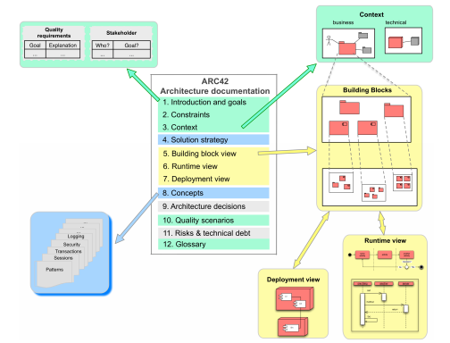

Arc42 is a template for architecture communication and documentation.

"Arc" is for Architecture, and "42" is based on the book "Hitchhikers Guide to the Galaxy", by Douglas Adams, where "42" is the 
> *“answer to the meaning of life, the universe, and everything” *

While Arc42 may not hold the "answer to the meaning of life, the universe, and everything", it does answer the following questions in a pragmatic way:
- What should we document/communicate about our architecture?
- How should we document/communicate?

# Template
The [Template](https://arc42.org/download) architecture doduments are available for download in many formats.

The template is guided documentation with [tips](https://docs.arc42.org/home/).

It can be tailored to your needs.

## ARC42
The arc42 documentation template aligns with the [C4 model](../C4). The diagrams map as follows:

| Arc42         | C4        
|:------------- |:------------
| Context and Scope             | System Context diagram
| Building Block View (level 1) | Container diagram
| Building Block View (level 2) | Component diagram
| Building Block View (level 3) | Class diagram

 
# Books

| Cover         | Title        
|:------------- |:------------
| ](bookexample.png)   |         arc42 Software Architecture Documentation in Practice: Real software architectures, documented with the arc42 template. Helps you jumpstart your own documentation.

# Related 
Related material:

| Item         | Details
|:------------- |:------------
| [Documenting Software Architectures](https://www.amazon.com/Documenting-Software-Architectures-Views-Beyond/dp/0321552687)   | Book: Documenting Software Architectures: Views and Beyond (2nd Edition) 2nd Edition
| [docToolchain](https://doctoolchain.github.io/docToolchain/) | Tool: docToolchain is an implementation of the [docs-as-code](https://www.writethedocs.org/guide/docs-as-code/) approach for software architecture plus some additional automation. The basis of docToolchain is the philosophy that software documentation should be treated in the same way as code together with the arc42 template for software architecture.
 

