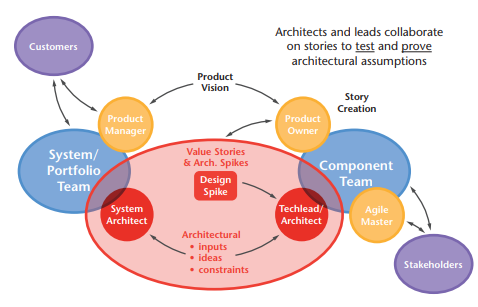
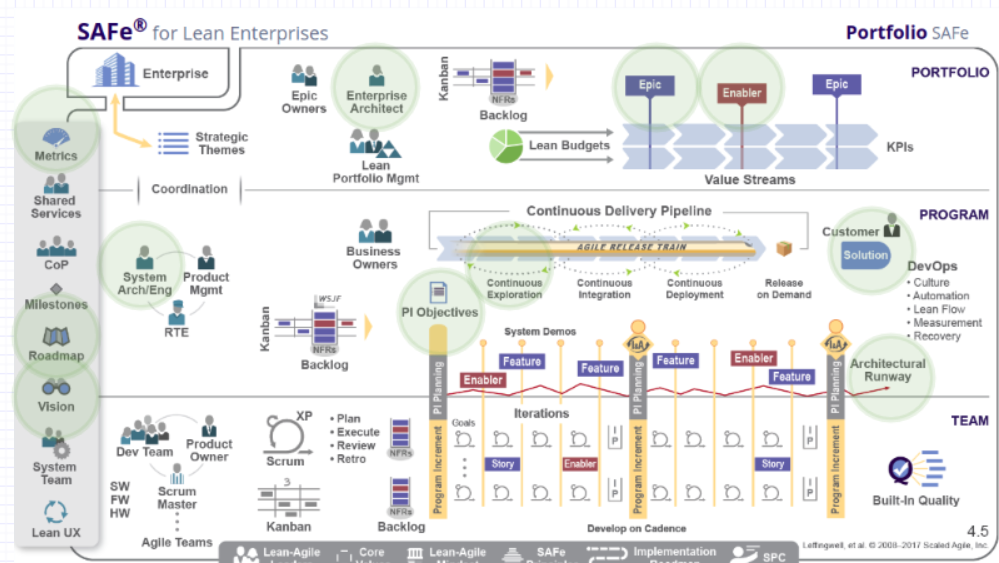
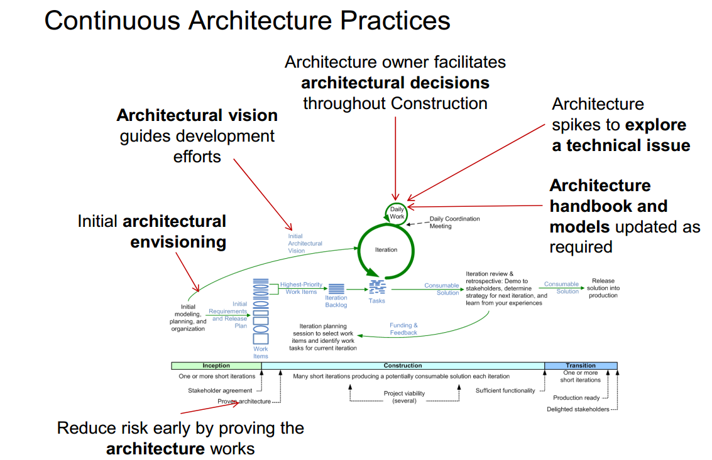
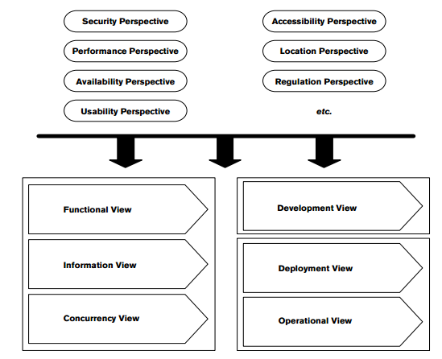
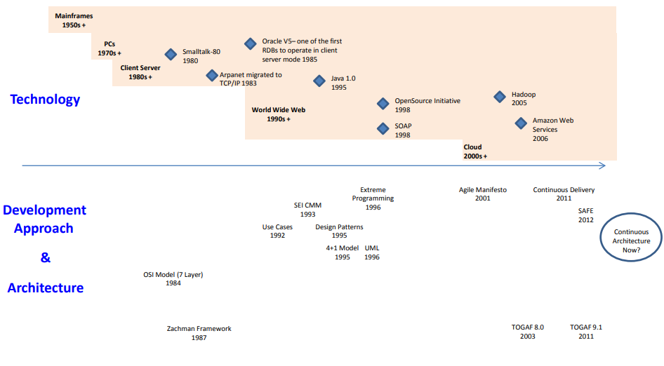

## Architecture

Architecture: "the fundamental concepts or properties of a system in its environment embodied in its elements, their relationships, and in the principles of its design and evolution" ([ISO IEEE 42010 Systems and software engineering — Architecture description](http://www.iso-architecture.org/ieee-1471/defining-architecture.html) )

The four most common reasons for developing a software architecture are to:

1. Define the guiding principles and standards. Architecture is a vision of the future, and supporting tools to help you get there.
2. Develop architecture models. In this case, architecture is concerned with abstracting at an appropriate level to make business and technical decisions.
3. Build common services. The services could be systems or organizations. Architecture can be defined as focusing on defining interfaces.
4. Create a roadmap to a future state, Architecture deals with transition planning activities that lead to the successful implementation of a blueprint.

**Agile Architecture**: Architectural practices aligned with Agile practices i.e. develop and improve the architecture rather than doing it once and creating the Big Architecture Up Front (BARF). Think Minimum Viable Architecture.

An **architectural principle** is a fundamental statement of belief, approach, or intent that guides the definition of an architecture. It may refer to current circumstances or to a desired future state.

## Define the guiding principles

### Scaled Agile Framework (SAFe)](https://www.scaledagileframework.com/) Architecture

[Scaled Agile Framework (SAFe)](https://www.scaledagileframework.com/) is the most mature framework to Scale Agile across multiple teams and throughout the organisation.

### [SAFe Principles](https://www.scaledagileframework.com/safe-lean-agile-principles/)

1. [Take an economic view](https://www.scaledagileframework.com/take-an-economic-view/)
2. [Apply Systems Thinking](https://www.scaledagileframework.com/apply-systems-thinking/)
3. [Assume Variability; preserve options](https://www.scaledagileframework.com/assume-variability-preserve-options/)
4. [Build Incrementally with fast, integrated learning cycles](https://www.scaledagileframework.com/build-incrementally-with-fast-integrated-learning-cycles/)
5. [Base milestones on objective evaluation of working systems](https://www.scaledagileframework.com/base-milestones-on-objective-evaluation-of-working-systems/)
6. [Visualize and limit WIP, reduce batch sizes, and manage queue lengths](https://www.scaledagileframework.com/visualize-and-limit-wip-reduce-batch-sizes-and-manage-queue-lengths/)
7. [Apply cadence, synchronize with cross-domain planning](https://www.scaledagileframework.com/apply-cadence-synchronize-with-cross-domain-planning/)
8. [Unlock the intrinsic motivation of knowledge workers](https://www.scaledagileframework.com/unlock-the-intrinsic-motivation-of-knowledge-workers/)
9. [Decentralize decision-making](https://www.scaledagileframework.com/decentralize-decision-making/)

#### Agile Architecture Overview and Context

1. Architecture touchpoints are highlighted in green
2. CI/CT architects are not highlighted here but are vital to customer solution delivery. This is spelled out explicitly in Continuous Architecture.

Go to [https://www.scaledagileframework.com/](https://www.scaledagileframework.com/) and click on these things in the diagram to learn more. Only a brief extract is quoted here:

[Agile Architecture](https://www.scaledagileframework.com/agile-architecture) Touchpoints

1. [Customer](https://www.scaledagileframework.com/customer/)
    * Customers are the ultimate buyer of every Solution. They are an integral part of the Lean-Agile development process and Value Stream and have specific responsibilities in SAFe. Whether internal or external, customers are increasingly demanding. They have choices. They expect solutions to work well and to solve their current needs. They also expect their solution providers to continuously improve the quality of their products and services.
2. [Enterprise Architect](https://www.scaledagileframework.com/enterprise-architect/):
    * The Enterprise Architect promotes adaptive design, and engineering practices and drives architectural initiatives for the portfolio. Enterprise Architects also facilitate the reuse of ideas, components, services, and proven patterns across various solutions in a portfolio.
    * Poor strategic technical planning, communication, and visibility can result in suboptimal systems performance across the enterprise, prompting significant redesign. To prevent this, and to support current and near-term business needs, these systems benefit by having some Architectural Runway and architectural governance (for example, to drive common usability and behavioral constructs across the Enterprise’s solution). To address parts of this problem, SAFe highlights the roles of System and Solution Architects, who provide much of this guidance at the Program and Large Solution Levels.
    * At the Portfolio Level, the challenge is even larger. Mergers and acquisitions, changes in underlying technologies and competition, emerging standards, and other factors often push businesses in directions beyond the scope of Agile Teams. To counter that,  Enterprise Architects have the authority and knowledge to work across Solution Trains and Agile Release Trains (ARTs). They can provide the strategic technical direction that can improve results. Aspects of this strategy may include recommendations for development and delivery of technology stacks, interoperability, APIs, and hosting strategies. These approaches produce results because Enterprise Architects foster incremental implementation while staying connected with the team’s work.
3. [Solution / System Architect](https://www.scaledagileframework.com/system-and-solution-architect-engineering/)
    * The Solution Architect/Engineering role represents an individual or small team that defines a shared technical and architectural vision for the Solution under development. They participate in determining the system, subsystems, and interfaces, validate technology assumptions and evaluate alternatives, working closely with the Agile Release Train (ARTs) and Solution Train. 
    * These individuals, or cross-disciplinary teams, take a ‘systems view’ on solution development (SAFe Lean-Agile Principle #2). They participate in defining the higher-level functional and Nonfunctional Requirements (NFRs). That includes analyzing technical trade-offs, determining the primary components and subsystems, and identifying the interfaces and collaborations between them. They understand the Solution Context and work with the teams, Customers, and Suppliers to help ensure fitness for purpose.
    * Collaborating with Solution and Product Management, Architect/Engineering plays a critical role in aligning teams to a shared technical direction toward the accomplishment of the Vision and Roadmap.
    * And, of course, Architect/Engineers are Lean-Agile Leaders who understand the complexities of large-scale solution development and apply SAFe Lean-Agile principles and practices to address them.
4. [Continuous Exploration](https://www.scaledagileframework.com/continuous-exploration/):
    * Continuous Exploration (CE) is the process of continually exploring the market and user needs, and defining a Vision, Roadmap, and set of Features that address those needs. It’s the first element in the four-part Continuous Delivery Pipeline
5. [Architectural Runway](https://www.scaledagileframework.com/architectural-runway/):
    *  The Architectural Runway consists of the existing code, components, and technical infrastructure needed to implement near-term features without excessive redesign and delay. It provides the necessary technical foundation for developing business initiatives and implementing new Features and/or Capabilities. The architectural runway is one of the primary tools used to implement the Framework’s Agile Architecture strategy.
    *  Since the development of new features and capabilities consumes the architectural runway, continual investment must be made to extend it by implementing Enablers. Some enablers fix existing problems with the Solution, such as improving the performance or User Experience. Others might provide foundational capabilities that will be used to support future functionality.
6. [Roadmap](https://www.scaledagileframework.com/roadmap/):
    *  The Roadmap is a schedule of events and Milestones that communicate planned Solution deliverables over a timeline. It includes commitments for the planned, upcoming Program Increment (PI) and offers visibility into the deliverables forecasted for the next few PIs.
    *  Of course, predicting the future is a hazardous business, and a Lean-Agile Enterprise must be able to respond to changing facts, learning, and business conditions. The real world, however, occasionally demands some certainty. So it may be necessary for enterprises to predict on a longer-term basis. Some initiatives take years to develop, and some degree of commitment must be made to Customers, Suppliers, and partners. Moreover, SAFe provides some guidance for forecasting over the longer term, based on the estimated scope of new work, the velocity of the Agile Release Trains (ARTs) and Solution Trains, and the current predictability of program execution. (See program predictability measure in Metrics).
7. [Vision](https://www.scaledagileframework.com/vision/)
    *  The Vision is a description of the future state of the Solution under development. It reflects Customer and stakeholder needs, as well as the Feature and Capabilities, proposed to meet those needs.
    *  The vision is both aspirational and achievable, providing the broader context—an overview and purpose—of the solution under development. It describes the markets, customer segments, and user needs. It sets the boundaries and context for new features, Nonfunctional Requirements (NFRs), and other work.
    *  The vision applies to any level of SAFe, which explains why it’s on the spanning palette. While its focus is typically on the solution, a portfolio vision is also clearly relevant, reflecting how the Value Streams will cooperate to achieve the Enterprise objectives. Agile Release Trains (ARTs) and Agile Teams may also have their own vision to communicate their part in developing the solution.
8. [Metrics](https://www.scaledagileframework.com/metrics/)

#### SAFe Agile Architecture Principles

[Agile Architecture](https://www.scaledagileframework.com/agile-architecture) is applicable to all levels of SAFe and is supported by the following [principles](https://www.scaledagileframework.com/agile-architecture):

1. Design emerges.
2. Architecture is a collaboration.
3. The bigger the system, the longer the runway.
4. Build the simplest architecture that can possibly work.
5. When in doubt, code or model it out.
6. They build it. They test it.
7. There is no monopoly on innovation.
8. Implement architectural flow.

### Continuous Architecture

Continuous Architecture builds on [Scaled Agile Framework (SAFe)](https://www.scaledagileframework.com/) with a focus on architecture for Continuous Delivery.

It follows the Continuous Architecture principles and is complemented by a number of well known tools: e.g. [ATAM](https://en.wikipedia.org/wiki/Architecture_tradeoff_analysis_method), [Value Chains](https://www.togaf-modeling.org/models/architecture-vision/value-chain-diagrams.html), Utility Trees, [Decision Logs](https://en.wikipedia.org/wiki/Architectural_decision) and [QFD](https://en.wikipedia.org/wiki/Quality_function_deployment) matrices (ref [presentation](http://www.rgoarchitects.com/Files/ATAM.ppt) )

This is architecture in the Continuous Delivery world.

#### **Continuous Architecture principles**

1. Architect products, not just solutions for projects
    * Architecting products is more efficient than just designing point solutions to projects and focuses the team on its customers.
2. Focus on Quality Attributes, not on functional requirements. 
    * Quality attribute requirements drive the architecture.
3. Delay design decisions until they are absolutely necessary.
    * Design architectures based on facts, not on guesses There is no point in designing and implementing capabilities that may never be used; it is a waste of time and resources.
4. Architect for change - leverage “the power of small." 
    * Big, monolithic, tightly coupled components are hard to change. instead, leverage small, loosely coupled services
5. Architect for build, test, and deploy. 
    * [https://www.scaledagileframework.com/design-for-testability-a-vital-aspect-of-the-system-architect-role-in-safe/](https://www.scaledagileframework.com/design-for-testability-a-vital-aspect-of-the-system-architect-role-in-safe/)
    * Most architecture methodologies exclusively focus on software building activities, but we believe that architects should be concerned about testing and deployment activities in order to support Continuous Delivery.
6. Model the organization after the design
    * The way teams are organized drives the architecture and design of the systems they are working on
       * Organizing teams by capability or product feature promotes effective communications among team members. 
            * Teams that use that approach discover that the vast majority of issues are identified early in the software development process. Issues are solved before they turn into unpleasant surprises at the end of the project or before they turn into defects in production
        * Organizing teams by component ensures component integrity: architectural integrity, interface quality, code quality....
            * This is an effective way to resolve known defects or to find defects in the context of the component.
    * We need both.  
    * ref [https://www.scaledagileframework.com/features-and-components/](https://www.scaledagileframework.com/features-and-components/)

### Disciplined Agile Delivery

#### Disciplined Agile Delivery Principles

Ref [Continuous Architecture and Emergent Design](https://www.agilealliance.org/resources/sessions/continuous-architecture-and-emergent-design/), Scott Ambler (author of DaD)

#### General Solution Architecture Principles

1. Architecture owners should understand why
2. Look beyond technology
3. Adopt a multi-view approach
4. Architecture is driven by requirements
5. Architectures should be loosely coupled
6. Architectural elements should be highly cohesive

#### Principles of Agile Solution Architecture

1. Think about the future, but wait to act
2. Learn early, learn fast
3. Simplicity first
4. Build quality in
5. Model in an agile manner
6. Be enterprise aware

### What are our principles?

##### Architect for build, test, and deploy and quantitative feedback

## Views

In the beginning, 4+1 view [https://en.wikipedia.org/wiki/4%2B1_architectural_view_model](https://en.wikipedia.org/wiki/4%2B1_architectural_view_model)

### Annex: Development Approaches

See [presentation](https://resources.sei.cmu.edu/asset_files/Presentation/2016_017_001_454847.pdf) or [book](https://www.amazon.co.uk/Continuous-Architecture-Sustainable-Agile-Cloud-Centric/dp/0128032847/ref=sr_1_1?ie=UTF8&qid=1526414344&sr=8-1&keywords=continuous+architecture) for more info

