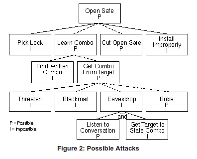
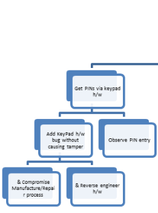
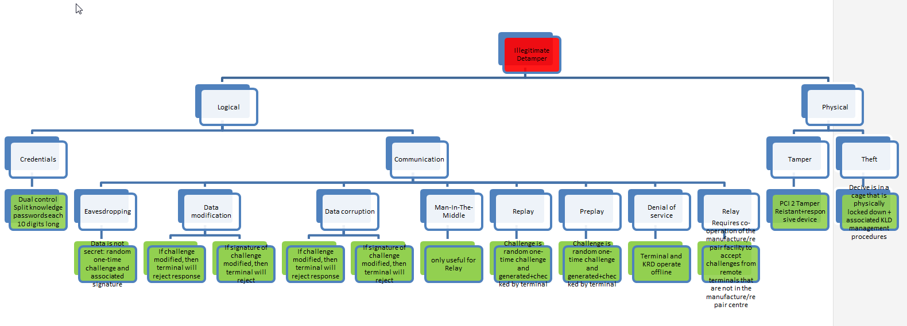

Attack trees provide a methodical way of describing the security of systems,based on varying known attacks. Basically, you represent attacks against a system in a tree structure, with the goal as the root node and different ways of achieving that goal as leaf nodes.

Attack Trees are essentailly lightweight Threat model - but the same same steps are used:
1. Identify Assets
2. Identify Threats
3. Understand Threats - this additionally requires an understanding of the system under threat
4. Categorize Threats
5. Rate Threats
6. Identify mitigation strategies (countermeasures)




ref: https://www.schneier.com/academic/archives/1999/12/attack_trees.html#rf1

Attack Trees
- Focus on what assets/data the design is trying to secure from what attacks.
- Are quick and easy to generate and understand.
- Are useful to many product stakeholders: Architects, Designers, Development, Test, Security team, Auditors
- Allow you to see the full picture. So you can really understand what it is you are trying to secure against and why.
- Allow you to see who’s worried about what attacks so you can see which ones YOU need to worry about.
- Are portable across products
- Allow you to put your security measures in the context of the full picture so you get the optimum level of security – not too much and not too little.


# Attack Tree Layout
The top node defines the attack objective e.g. to get the PIN number.

There may be different attack objectives e.g. Get PIN, Get Card Data, Get keys, etc…

Each attack objective should be in a separate tree (and can be linked to an overall master tree)
The most sensitive data or objectives should be addressed first e.g. the following assets are listed in descending order of sensitivity (or security worth)
- PIN keys
- PINs
- Card data keys
- Card data
- Software
So the first attack tree to be addressed should be one that focuses on PIN keys as the attack objective. 

The sub-nodes drill down into the details of how this attack objective can be achieved 
e.g. to to get the PIN number, one can do any one of the following:

"get the pin via keypad h/w" i.e. a hardware attack
"Get PIN keys" i.e. keys used to encrypt PINS i.e. an indirect attack
"Get PIN via malicious code" i.e. a software attack

A successful attack path is from the top of the graph to any node on the bottom of a branch.

An assessment can be made of how likely the various attack paths are and therefore which ones need to be addressed with highest priority.

## And Or
Nodes can be And'd or Or'd

### Or
Nodes are normally assumed to be OR'd i.e. one or the other path can be followed to achieve the parent goal. 
e.g. To "Get PINs via keypad h/w" one can
- "Add KeyPad h/w bug without causing tamper"
- OR
- "Observe PIN entry"


Nodes can be AND'd together to show that 2 or more paths are required to complete the goal.
Such nodes are prefixed with an "&".
e.g. To "Add KeyPad h/w bug without causing tamper" one can
- "Compromise Manufacture/Repair Process"
- AND
- "Reverse Engineer h/w"


# Large Trees
The best way to organise large or separate attack tress is to reference them from one overall index tree.

A Master Attack Tree is created with the main nodes.

A given node is detailed in a separate detailed attack tree for that node.

The Master Attack Tree references that sub-tree via hyperlink i.e. in Master Attack Tree, right-click - hyperlink

# Auto-Drawing Attack Trees
Attack Trees could be drawn by hand. 
Some options described here to auto-draw Attack Tree diagrams from text.

## PlantUML
PlantUML [Mindmap](http://plantuml.com/mindmap-diagram) or [WorkBreakdown](http://plantuml.com/wbs-diagram) diagrams can be used to render the Attack Tree text description.


## MS Powerpoint
1. Attack Tree is written as a tab-indented text file e.g. extract: 
```
Get PIN
       Get PINs via keypad h/w
              Add KeyPad h/w bug without causing tamper
                     Compromise Manufacture/Repair process
                     Reverse engineer h/w
              Observe PIN entry
       Get PIN keys
```
2. Open MS PowerPoint 
3. Insert – SmartArt – Hierarchy – Hierarchy
4. CopyNpaste Attack Tree text
5. Diagram is auto-drawn
   


# Countermeasures
Using a different attack tree as an example, the countermeasures can also be shown in the tree for each attack:

attack goal is highlighted in red
attack countermeasures for each attack are highlighted in green (in can be changed in bulk by selecting all the boxes and then change color 



# Attack Types
Different systems will have different types of attacks.

## CAPEC
The [Common Attack Pattern Enumeration and Classification](https://capec.mitre.org/data/definitions/1000.html) dictionary and classification taxonomy can be used to ensure attacks are considered in a comprehensive, standard way. 


## Communication Link Attacks
 

| Type         | Details        
|:------------- |:------------
| Eavesdropping         |Data on the communication line  is gathered i.e. confidentiality compromised.
| Data modification             | Data on the communication line is modified but still valid i.e. integrity compromised.
| Data corruption              | Data on the communication line is modified and no longer valid  i.e. integrity compromised.
| Man-In-The-Middle              | A device is placed in the middle of the two communication end points in an  attempt to  actively partake in the conversation/communication with the intention of causing illegitimate action or service.
| Replay             | A message is sent again to repeat some action.
| Preplay             | A message is sent in advance of the legitimate communication session between the two legitimate end points.
| Relay             | A message is forwarded outside of the intended communication environment
| Denial of service             | Messages are sent to overwhelm the communication end points to prevent legitimate communication and service.
| Reflection attack             | A method of attacking a challenge-response authentication system that uses the same protocol in both directions. That is, the same challenge-response protocol is used by each side to authenticate the other side. The essential idea of the attack is to trick the target into providing the answer to its own challenge.


# Related Methods
Some heavyweight Threat Modelling tools and frameworks are listed here for reference.

## STRIDE
STRIDE is problaby the best known [Threat Model](https://en.wikipedia.org/wiki/Threat_model). 
[Spoofing - Tampering - Repudiation - Information Disclosure - Denial of Service - Escalation of Privilege](https://en.wikipedia.org/wiki/STRIDE_(security)) from MicroSoft.

There is also an associated [Microsoft free threat modeling tool](https://www.microsoft.com/en-us/download/details.aspx?id=49168).

## OCTAVE
The Operationally Critical Threat, Asset, and Vulnerability Evaluation (OCTAVE) is a 
security framework for identifying, addressing and managing information security assessments and and risk-based planning. It consists of tools, technologies and procedures for helping organizations identify and evaluate the security risks they face. OCTAVE is primarily targeted at organization-related security risks rather than technological risks.

## VAST
VAST (Visual, Agile and Simple Threat modelling) is aimed at automated threat analysis across the enterprise infrastructure and entire SDLC. It is based on [ThreatModeler](https://www.threatmodeler.com/) tool.
