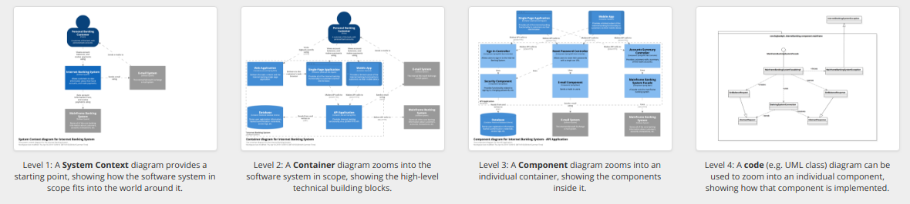

# Introduction

https://c4model.com/

The [C4 Model](https://c4model.com/) is a lightweight software architecture technique.
It is inpsired by [the 4+1 model for software architecture](https://en.wikipedia.org/wiki/4%2B1_architectural_view_model)

It can be combined with arc42 documentation template. The diagrams map as follows:

| Arc42         | C4        
|:------------- |:------------
| Context and Scope             | System Context diagram
| Building Block View (level 1) | Container diagram
| Building Block View (level 2) | Component diagram
| Building Block View (level 3) | Class diagram
 
# Books

These books, written by [@simonbrown](https://twitter.com/simonbrown), are available to buy from https://leanpub.com/visualising-software-architecture. 

## Software Architecture for Developers: Volume 1 - Technical leadership and the balance with Agility
](swarchv1.png)

## Software Architecture for Developers - Volume 2 - Visualise, document and explore your software architecture
As at 2019-6-15 this book is 80% complete LAST UPDATED ON 2019-03-05
](swarchv2.png)

# C4 Plantuml VSCode 
TODO