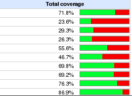

1. This is a "Postcard from the future" [vision](https://www.scaledagileframework.com/vision/) of automated testing.
2. It gives an overview and details of the automated test levels.
3. The purpose is to elicit feedback on what we want, by presenting a vision of what we have in the future.
4. Once we know what we want, then we can start to phase it in via who/what/when...

**Early and often!**

This is heavily-based on [A Practical Approach to Large-Scale Agile Development](https://www.amazon.co.uk/Practical-Approach-Large-Scale-Agile-Development/dp/0321821726) that HP used for their embedded printer group of 400 developers to significantly improve productivity and value delivery.

Basically they setup the foundations of a [Continuous Delivery pipeline](https://www.scaledagileframework.com/continuous-delivery-pipeline/)

**As they say "writing good test automation is harder than writing code"**

## Overview

For Software Assurance, a number of automated checks should be incorporated into our CI/CT environment.

<table>
  <tr>
   <td>
Purpose
   </td>
   <td>
Name
   </td>
   <td>
Type
   </td>
   <td>
Details
   </td>
   <td>
Tests/Checks
   </td>
   <td>
When
   </td>
   <td>
Where
   </td>
  </tr>
  <tr>
   <td>
Integration
   </td>
   <td>
<h4>
L0</h4>

   </td>
   <td>
<h4>
Pre-commit testing</h4>

   </td>
   <td>
<ol>

<li>Done by the developer on his/her own development machine before committing to the main trunk
</li>
</ol>
   </td>
   <td>
<ol>

<li>tests 
<ol>
 
<li>Q1 Agile testing for the repos changed
</li> 
</ol>

<li>Cppcheck of the repo (pass criteria: no errors)

<li>Gcc warnings as errors (pass criteria: no warnings)

<li>Coding style checks/guidelines auto-checked

<li>Deprecated/unsafe functions checked e.g. Warning generation on use of unsafe C functions  
<ol>
 
<li>private APIs that should not be called by an application could also be checked in a similar way to deprecated/unsafe functions
most IDE's support plugins for running cppcheck, style checks/guidelines in the background transparently as you edit.
</li> 
</ol>
</li> 
</ol>
   </td>
   <td>
<ol>

<li>pre-commit
</li>
</ol>
   </td>
   <td>
<ol>

<li>Developer's PC

<li>Simulator
</li>
</ol>
   </td>
  </tr>
  <tr>
   <td>
Integration
   </td>
   <td>
<h4>
L1</h4>

   </td>
   <td>
<h4>
Commit testing</h4>

   </td>
   <td>
<ol>

<li>Happens automatically at the time a developer commits new code to the main GIT trunk broken into Stage 1 and Stage 2 for easy autorevert

<li>Auto-revert of changes / ticket that breaks build / build-test. \

</li>
</ol>
   </td>
   <td>
<ol>

<li>tests 
<ol>
 
<li>All Q1 Agile testing run (because these are fast) (pass criteria: all public APIs unit tested. >=80% coverage per repo/component)
</li> 
</ol>

<li>Cppcheck on commit GIT hook (ref Cppcheck Secure Static Analysis on GIT PUSH Process)

<li>Coding guidelines auto-checked
</li>
</ol>
   </td>
   <td>
<ol>

<li>on-commit

<li>10-14x/day
</li>
</ol>
   </td>
   <td>
<ol>

<li>Simulator
</li>
</ol>
   </td>
  </tr>
  <tr>
   <td>
Stability
   </td>
   <td>
<h4>
L2</h4>

   </td>
   <td>
<h4>
Quick-turn broad based testing by pillar</h4>

   </td>
   <td>
<ol>

<li>Quick-turn broad-based testing by pillar

<li>Intended as a quick feedback loop to find broad-based failures from new commits in as narrow of a commit window as feasible
</li>
</ol>
   </td>
   <td>
<ol>

<li>tests 
<ol>
 
<li>All Q1 Agile testing run by pillar (because these are fast) (pass criteria: all public APIs unit tested. >=80% coverage per repo/component)
 
<li>All Q2, Q3 Agile testing run by pillar
</li> 
</ol>

<li>Code churn measured per file/repo/component/pillar

<li>SonarQube analysis run

<li>Vulnerability Analyis + GPL compliance (e.g. BlackDuck) run

<li>Check Public Vulnerability lists

<li>Binary Compatibility testing: generate reference APIs definition signature and ensure these are not broken i.e. catch if APIs change (ABI checker)

<li>public APIs 
<ol>
 
<li>doxygen documentation
 
<li>PCI code extracts 
</li> 
</ol>

<li>Permissions and privileges review
</li>
</ol>
   </td>
   <td>
<ol>

<li>every 2 hours across multiple test machines in parallel

<li>12x/day
</li>
</ol>
   </td>
   <td>
<ol>

<li>Simulator

<li>Emulator
</li>
</ol>
   </td>
  </tr>
  <tr>
   <td>
Stability
   </td>
   <td>
<h4>
L3</h4>

   </td>
   <td>
<h4>
Same as L2 but on real HW</h4>

   </td>
   <td>
<ol>

<li>Same purpose as L2, but on real hardware

<li>You can know that full build, s/w download, boot, and general capability are working end-to-end
</li>
</ol>
   </td>
   <td>
<ol>

<li>Tests \
 
<ol>
 
<li>All Q1 Agile testing run (because these are fast) (pass criteria: all public APIs unit tested. >=80% coverage per repo/component)
 
<li>All Q2, Q3, Q4 Agile testing run
 
<li>As per L2
</li> 
</ol>
</li> 
</ol>
   </td>
   <td>
<ol>

<li>6x/day
</li>
</ol>
   </td>
   <td>
<ol>

<li>Real Hardware
</li>
</ol>
   </td>
  </tr>
  <tr>
   <td>
Regression
   </td>
   <td>
<h4>
L4</h4>

   </td>
   <td>
<h4>
Full regression test suite of all automated tests</h4>

   </td>
   <td>
<ol>

<li>Provides complete view of the quality of the system.

<li>If passing rate drops substantially, should have seen a dip in L2 testing (otherwise, update L2 list)
</li>
</ol>
   </td>
   <td>
<ol>

<li>Full regression test suite of all automated tests.

<li>Code churn measured per file/repo/component/pillar

<li>SonarQube analysis run

<li>Check Public Vulnerability lists

<li>Coverity
</li>
</ol>
   </td>
   <td>
<ol>

<li>midnight daily

<li>1x/day
</li>
</ol>
   </td>
   <td>
<ol>

<li>Real Hardware
</li>
</ol>
   </td>
  </tr>
</table>

         

Levels e.g. L0, L1,...Ln (versus QE, SIT, ....) are used to convey what phase the testing happens in i.e. the name conveys there is a pipeline and it starts at development time 

"pillar" is a high level feature e.g. payment (contact, contactless, MSR), content update (keys, s/w, config), connectivity (wifi, BT modem,...). It crosses multiple components.

### Integration Queue stage 1 and 2

1. Integration Queue stage 1 is a developers personal commit. It gets submitted and run in a central test farm.
    1. Every developer has his or her own stage 1, and each starts executing real-time as a developer commits their changes.
    2. Each is processed and,
        1. if successful, gets promoted as part of a group to Stage 2
        2. If unsuccessful, the change is automatically reverted and the developer is notified all without impacting anyone else committing code.
    3. The primary goal of Stage 1 integration is to keep stupid mistakes from hurting others so that the good code can make it in more frequently This accomplishes the ideal case of autorejecting any code causing test failures before it gets to the main code trunk.
2. Integration Queue Stage 2 then kicks off on a time interval with any commits that have made it past Stage 1 successfully and processes these code commits all together.
    4. running a similar test suite to the one in Stage 1, but with more extensive testing where possible and on multiple platforms, including some hardware (but still automated)
    5. If any merge conflicts occur that cause any test failures, the whole set of commits in a given Stage 2 get autoreverted. This gets the train wreck off the tracks so traffic can flow (the next Integration Queue Stage 2 group of changes) and just the few affected have to do the extra work of recommitting. This approach has created a process that enables large-scale continuous integration without ever having main broken
3. We ended up choosing this model because it provided the right balance of real-time quality versus feature throughput. A combination of “my personal change looked fine" (Stage 1) along with “a small group of changes created a successful central build" [Stage 2) gave flexibility and quality without overwhelming the system.

### Different types of test platforms

1. Simulator
    1. A wholly software-based development and test environment that can run locally on someone’s own development box or in our automated test farm.
    2. We want to find all code issues either in unit testing or in end-to-end simulator testing.
2. Emulator
    3. similar to the simulator (shared code), but also includes the real h/w for the product so real timing, memory, and connectivity, interfaces can be exercised. But all the code above this runs in the Simulator. Test libraries exist so that the same test can execute on either a simulator or an emulator.
3. Product hardware
    4. Even when we do have to run tests on real hardware due to simulation / emulation limitations, we still utilize automatic button pressing and card insertion to the device wherever possible to make it hands off anytime we can. Having massive amounts of pure manual testing is the downfall of many large efforts to move to agile. We have a full dedicated team doing simulator/ emulator enhancements.
    5. For additional testability, productivity, and to assess ongoing needs for simulation as more complex features are developed. We used to deliver new products and features and only ask well into development what additional simulation support we needed. Now we talk about it and act on it as the very first thing and try to have the new capabilities in place just in time for when the rest of the organization needs to engage.

### Manual Code Reviews

[Manual Code Reviews and CI](https://softwareengineering.stackexchange.com/questions/121664/when-to-do-code-reviews-when-doing-continuous-integration) (from the horse's mouth / author of [Continuous Delivery](https://www.amazon.co.uk/Continuous-Delivery-Deployment-Automation-Addison-Wesley/dp/0321601912))

    To summarize: code review is good. So good, we should be doing it continuously, through pair programming and reviewing commits. If a senior dev finds a bad commit, she should pair with the person who committed it to help them fix the problem.

    Gating merge to mainline on a formal review is bad, and creating branches to do so is extra bad, for the same reason that feature branches are bad.

[https://groups.google.com/d/msg/continuousdelivery/LIJ1nva9Oas/AovdGc1tlzQJ](https://groups.google.com/d/msg/continuousdelivery/LIJ1nva9Oas/AovdGc1tlzQJ)

    I definitely advocate a systematic approach. All check-ins should be systematically reviewed by the dev lead as soon as possible after the check-ins occur.

    Furthermore, all code that is to be checked in must have been reviewed by one other person before check-in (as part of pair programming). This should also be systematic, i.e. built into the system.

    So 100% of commits should be reviewed, both before and after check-in (i.e. twice).

    What I don't recommend is creating gated processes that try to enforce this, either by using branches in version control, or by adding stages to the pipeline. I say this for two reasons:

    1. it inhibits continuous integration

    2. it assumes that people are going to be stupid and that your process must correct for this, rather than that people will overall try to do the right thing, but that we must put something in place to manage the exceptions. Basically, your process should follow theory Y not theory X: [http://en.wikipedia.org/wiki/Theory_X_and_theory_Y](http://en.wikipedia.org/wiki/Theory_X_and_theory_Y)

    In general, managers spend too much time trying to create complex processes to try and enforce "good behaviour" rather than building systems in which good behaviour naturally emerges. I like to call this kind of Theory X thinking "risk management theatre" because it provides the impression that risk is being managed effectively, while actually producing lower quality results.

[https://groups.google.com/d/msg/continuousdelivery/LIJ1nva9Oas/MSmHpGk153cJ](https://groups.google.com/d/msg/continuousdelivery/LIJ1nva9Oas/MSmHpGk153cJ)

## Test Levels

### L0 Testing

1. Some short smoke test is done to make sure the change does not break the system in a major way
2. Developer executes 
    1. their individual unit tests for the **components** they are changing
    2. the unit tests for that component
    3. a team-specific short suite of tests
3. It is not intended that L0 testing become so big as to guarantee that all the post-commit testing levels will all pass 100% of the time. This would drive integration cycle times up so high that "frequent small integrations" that are fundamental to Continuous Integration (CI) would never be possible. 
4. L0 is all about engineering judgement. About what is "just enough" testing to avoid wreaking havoc on the overall system, but still allowing developer productivity to remain high.

### L1 Testing

1. L1 is the key to overall productivity as well as how many builds we can produce in a day.
2. The big difference between L1 and the remaining testing levels (L2 through L4) is the difference between auto-revert versus manual intervention. This auto-revert is very important for productivity.
3. By design, we don't "stop the current train" for L2 - L4 testing
    1. for L2-L4 testing, the test fails and we have mechanisms (auto-jira, auto-email, reports,...) to be aware of what failed and why, so we can get on these issues quickly and get tests passing again.
    2. in the same way that metrics alignment can take status meetings out of the process, autorevert can take huge amounts of work out of the system. When bad code makes it to L2 testing or beyond, responding to failures all becomes manual

### L2 Testing

1. This form of testing is kicked off on a timer every 2 hours and uses that last good firmware build from L1 testing. If you can’t autorevert in L1 testing, the next best option is to have as many builds a day go through L2 testing as possible so you can quickly catch and address the offending code. 
2. L2 tests (frequent high-level test coverage per **pillar**) are intended to be the protection mechanism of L4 (daily full regression per **pillar**). If we see a failure in L2 tests that we can act on quickly, it prevents us from seeing a large spike in failed L4 tests that night. L2 is designed to make sure nothing catastrophic was missed in L1 before we get a full day and 100 commits down the road to have to debug after L4.
3. Each **pillar** of the firmware system is allotted one test machine in the farm for a maximum of two hours of tests-whatever they feel is the best subset of their full L4 regression suite. By design, it should be a somewhat dynamic test suite. As new features are added, coverage in L2 should be provided. As certain areas become completely stable and L2 never finds any issues, those tests can be pulled out (if over the two-hour limit). Two hours was picked to get a quick response back on a failure. 
4. A notification mechanism in place that goes out to all developers who committed changes in a particular build that goes into L2 testing. 
    1. The notification goes out only if a test that was previously passing now begins to fail. 
    2. The notification includes the name of the test, a drill down to the details of the failure, and a zip file with everything required to replicate the test on a development boxt 
        1.  Although a manual response is required [vs autorevert for L1), it quickly gives us significant test coverage (12 times per day), and most of the failures get fixed (or the change reverted) within a day without even bothering to submit a change request to track, One of the primary measures of success for the effectiveness of the L2 suites is that we notice a failure in an L2 suite before a spike of failures hits our L4 testing (that runs every 24 hours).

### L3 Testing

1. L3 testing is just like L2 except on hardware, which runs every four hours. some point we have to make sure that something beyond our simulation environment actually works
    1. substantially so we can continue developing most features and finding most code issues there). If L3 goes down, our test partners (software, hardware, system testing) can’t get new firmware, so it becomes urgent to get fixed. This happens often enough [every few weeks) that we need to put in place the next iterative improvement to either get hardware into L1 or provide duplicate hardware so that if a hardware problem exists, we can try it out on a backup unit 

### L4 Testing

1. This testing runs the whole regression test suite every night when it used to take weeks.
2. L4 failures aren’t necessarily urgent to fix unless we’re getting close to a release candidate to be shipped out to the customer. They are prioritized based on how many tests a particular issue is blocking. But the real beauty is, we know our quality within 24 hours of any fix going into the system. You can imagine that it is a lot more helpful for the developers to hear that what they committed yesterday broke something, rather than to hear that a test is broken based on something somebody did sometime since this test was run six weeks ago. And we can test broadly even for small last-minute fixes to ensure a bug fix doesn’t cause unexpected failures. Or we can afford to bling in new features well after we declare “functionality complete" or in extreme cases, even after we declare a release candidate Now that’s agile!

## Test Dashoard

This is the real time test report dashboard available for L2-L4 tests.

 % Test Coverage graph per component 

It is critical to have a common set of metrics that everyone tracks so all levels of the organization are on the same page.

## Common Development and Comment Test Environment

Developers and Testers should have the same development and test environment to avoid the "it works on my machine".

If you are going to use automated testing and Continuous Integration (CI) to dramatically improve your productivity, you need to treat your testing investments as being at least as important, or even more important, than your development investments, which is a big cultural change for most organizations.

Ensure there is an overall full time test architect 

Read [Continuous Delivery](https://www.amazon.co.uk/Continuous-Delivery-Deployment-Automation-Addison-Wesley/dp/0321601912) before you make any significant investments in automated testing.

### Annex: A Practical Approach to Large Scale Agile Development" - Gary Gruver at Spark 2013

See book [A Practical Approach to Large-Scale Agile Development]

[https://youtu.be/2QGYEwghRSM](https://youtu.be/2QGYEwghRSM)

"The value in terms of that feedback, and the frequency of it, and the quality of it, to your developers can not be understated. If you look at 2 things we did that really dramatically moved the needle

1. getting to 1 branch...
2. getting quality timely feedback to all your developers so they could learn, evolve, adjust"

"If you're doing an embedded system, you can't do all your testing on a product"

## References

1. [https://martinfowler.com/articles/continuousIntegration.html#MakeYourBuildSelf-testing](https://martinfowler.com/articles/continuousIntegration.html#MakeYourBuildSelf-testing)
2. [A Practical Approach to Large-Scale Agile Development](https://www.amazon.co.uk/Practical-Approach-Large-Scale-Agile-Development/dp/0321821726)
3. [https://github.com/adhocteam/ca-alert/wiki/Code-review,-continuous-integration,-and-deployment-processes](https://github.com/adhocteam/ca-alert/wiki/Code-review,-continuous-integration,-and-deployment-processes)
4. [Continuous Delivery](https://www.amazon.co.uk/Continuous-Delivery-Deployment-Automation-Addison-Wesley/dp/0321601912)
5. [https://www.rainforestqa.com/blog/2016-06-07-implementing-continuous-delivery-how-we-ship-code-at-rainforest/](https://www.rainforestqa.com/blog/2016-06-07-implementing-continuous-delivery-how-we-ship-code-at-rainforest/)
6. [https://www.scaledagileframework.com/built-in-quality/](https://www.scaledagileframework.com/built-in-quality/)
7. [https://docs.microsoft.com/en-us/azure/devops/learn/devops-at-microsoft/shift-left-make-testing-fast-reliable](https://docs.microsoft.com/en-us/azure/devops/learn/devops-at-microsoft/shift-left-make-testing-fast-reliable)