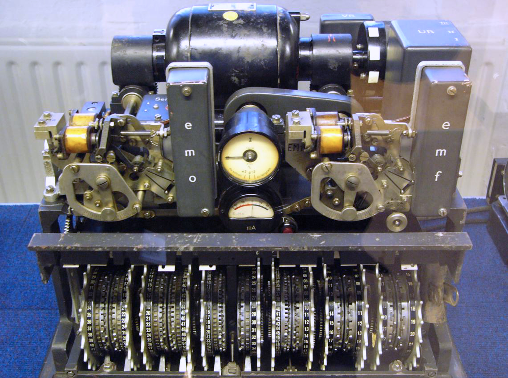
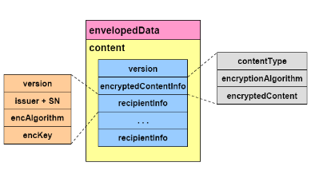

Algorithms and keys sizes change over time as technology advances
1. e.g. from [DES (to 2TDEA to 3TDEA) to AES](https://www.cryptomathic.com/news-events/blog/3des-is-officially-being-retired).
2. e.g. from RSA to ECC to [future Quantum-resistant cryptography](https://nvlpubs.nist.gov/nistpubs/ir/2016/nist.ir.8105.pdf)
3. e.g. from MD5 [to SHA-1 to SHA-2 to SHA-3](https://www.csoonline.com/article/2879073/all-you-need-to-know-about-the-move-from-sha1-to-sha2-encryption.html)

If this change is not accounted for when designing a system, it can prevent future proofing, and make the transition and maintenance
1. more painful i.e. more effort
2. slower - i.e. increase exposure window

This page gives 
1. a definition of crypto agility.
2. guidelines for crypto agility.
3. a simple practical example for crypto agility.

# Definition

[Cryptographic Agility](https://en.wikipedia.org/wiki/Crypto-agility#) can be [described as three properties](https://randomoracle.wordpress.com/2014/11/09/the-challenge-of-cryptographic-agility/), in order of priority:

1. Users can choose which cryptographic primitives (such as encryption algorithm, hash-function, key-exchange scheme etc.) are used in a given protocol
2. Users can replace the implementation of an existing cryptographic primitive, with one of their choosing
3. Users can set system-wide policy on choice of default algorithms 


Per [RFC7696](https://www.rfc-editor.org/info/rfc7696), Cryptographic Agility is achieved when a protocol can easily migrate from  one algorithm suite to another more desirable one, over time.  
* For the protocol implementer, this means that implementations should be modular to easily accommodate the insertion of new algorithms or suites of algorithms.  Ideally, implementations will also provide a way to measure when deployed implementations have shifted away from the old algorithms and to the better ones.  
* For the protocol designer, algorithm agility means that one or more algorithm or suite identifiers must be supported, the set of mandatory-to-implement algorithms will change over time, and an IANA registry of algorithm identifiers will be needed. 


This is really just standard good software design practice i.e. loose coupling as part of loose-coupling, high-cohesion.

## Examples of Cryptographic Algorithm Agility
The following well known protocol examples dynamically allow the algorithm to change while still allowing interoperability:
* TLS, IPSEC for communication
* CMS for data encapsulation

## Protocol Agility
The above defintion of Cryptographic Agility is focused on Algorithm Agility. However, protocols themselves evolve over time and this changed must be supported also.
This is typically done by 
* upgrading the protocol implementation (i.e. software version) that supports the later protocol version
* support the older protocol for an interim transition period
* deprecate support for the older protocol when ready


# Guidelines for being Crypto Agile

1. [Use higher level crypto interfaces](https://github.com/Crashedmind/DevGuide/blob/master/03-Build/0x11-Cryptography.md#avoid-creating-your-own-cryptography) i.e. standard protocols, else schemes that support "cipher suites" - don't call raw crypto primitives
   * where a "cipher suite" is a set of pre-defined configurations for algorithm and key size and parameter size e.g. as used in TLS, or [CMS](https://tools.ietf.org/html/rfc5652).
   * Avoid creating your own crypto algorithms, formats, solutions. Conform to crypto standards - making it easier to transition to a different solution.
   * use identifiers and versions for crypto algorithms, messages, formats https://tools.ietf.org/html/draft-housley-crypto-alg-agility-00 i.e. from the payload alone it should be possible to uniquely identify what crypto was used to process that payload
2. use-a-conservative-minimum-trusted-set-of-primitives-and-schemes
   * supporting too many leads to higher probability that one will need to change 
   * supporting only one increases the impact if change required
3. Use a modular approach to security building blocks / services
   * i.e. loose-coupling, high-cohesion.
4. Walk - don't run
   * i.e. do a self-assessment and come up with a long-term plan for crypto-agility and quantum-resistance that fits with overall product roadmap


# Example

Taking the example code from the [book Network Security with OpenSSL](https://www.amazon.com/_/dp/059600270X): source code [here](https://resources.oreilly.com/examples/9780596002701/blob/master/NSwO-1.3/EX10-9):

This program PKCS#7 encrypts input from the command line, with the  certificate specified on the command line, to create an output EnvelopedData type. The same program can do the corresponding EnvelopedData decryption.

Using PKCS#7/[CMS](https://tools.ietf.org/html/rfc5652) per guidelines makes it easier to change the asymmetric or symmetic algorithm involved with encrypting the input data. The resulting Content Type is self-describing i.e. it says what asymmetric or symmetic algorithms were used to encrypt the data.


````
/* choose cipher and read in all certificates as encryption targets */
      cipher = EVP_des_ede3_cbc ();
      certs = sk_X509_new_null ();
        ....

      if (!(pkcs7 = PKCS7_encrypt (certs, in, cipher, 0)))

````
NOTE: CMS_encrypt() should be used instead of PKCS7_encrypt() to support ECC.

## Asymmetric Encryption

For the executable, there is no change in usage between RSA and ECC encryption/decryption (just the certificate passed in is different); Openssl PKCS#7/CMS routines know if asymmetric algorithm (RSA or ECC) should be used based on the certificate passed in to do the encryption/decryption.

````
ECC encrytion
echo SECRET | ./ed encrypt E_ECC.crt.pem > enc.txt

ECC decryption
cat enc.txt | ./ed decrypt E_ECC.pem E_ECC.crt.pem
  
RSA encryption
echo SECRET | ./ed encrypt E_RSA.crt.pem > enc.txt

RSA decryption
cat enc.txt | ./ed decrypt E_RSA.pem E_RSA.crt.pem

````


## Symmetric Encryption

In the source code, the symmetric algorithm used is hardcoded in the source code instead of being passed in as a parameter to the program.

But even so, the PKCS#7/CMS EnvelopedData type created will indicate what symmetric algorithm was used. The receiver can identify and automatically change the symmetric algorithm used to decrypt the data.

## PKCS7 / CMS EnvelopedData Type



The process by which enveloped data is constructed involves the following steps:
1.	A content-encryption key for a particular content-encryption algorithm is generated at random.
2.	For each recipient, the content-encryption key is encrypted with the recipient's public key.
3.	For each recipient, the encrypted content-encryption key and other recipient-specific information are collected into a RecipientInfo value.
4.	The content is encrypted with the content-encryption key.
5.	The RecipientInfo values for all the recipients are collected together with the encrypted content into a EnvelopedData value.

A recipient opens the envelope by decrypting one of the encrypted content-encryption keys with the recipient's private key and decrypting the encrypted content with the recovered content-encryption key.  

The fields of type EnvelopedData have the following meanings:

* version is the syntax version number. 
* recipientInfos is a collection of per-recipient information. There must be at least one element in the collection.
* encryptedContentInfo is the encrypted content information.

The fields of type EncryptedContentInfo have the following meanings:
* contentType indicates the type of content.
* contentEncryptionAlgorithm identifies the content-encryption algorithm (and any associated parameters) under which the content is encrypted. This algorithm is the same for all recipients.
* encryptedContent is the result of encrypting the content. 

The fields of type RecipientInfo have the following meanings:
* version is the syntax version number. 
* issuerAndSerialNumber specifies the recipient's certificate (and thereby the recipient's distinguished name and public key) by issuer distinguished name and issuer-specific serial number.
* keyEncryptionAlgorithm identifies the key-encryption algorithm (and any associated parameters) under which the content-encryption key is encrypted with the recipient's public key. 
* encryptedKey is the result of encrypting the content-encryption key with the recipient's public key. 


# Post-Quantum Cryptography

[NIST Report on Post-Quantum Cryptography](https://nvlpubs.nist.gov/nistpubs/ir/2016/nist.ir.8105.pdf) emphasizes the real need for Crypto Agility where asymmetic algorithms especially will be replaced by quantum-resistant alternatives - which have not been determined yet:
* "As the replacements for currently standardized public key algorithms are not yet ready, a focus on maintaining crypto agility is imperative."
* "The report also recognizes the challenge of moving to new cryptographic infrastructures and therefore emphasizes the need for
agencies to focus on crypto agility."

[NIST Special Publication 800-131A Revision 2 Transitioning the Use of Cryptographic Algorithms and Key Lengths](https://nvlpubs.nist.gov/nistpubs/SpecialPublications/NIST.SP.800-131Ar2.pdf) 
* "NIST encourages implementers to plan for cryptographic agility to facilitate transitions to quantum-resistant algorithms where needed
in the future"


# References
1. [Guidelines for Cryptographic Algorithm Agility and Selecting Mandatory-to-Implement Algorithms RFC 7696 Nov 2015](https://www.rfc-editor.org/info/rfc7696)
2. https://media.blackhat.com/bh-us-10/whitepapers/Sullivan/BlackHat-USA-2010-Sullivan-Cryptographic-Agility-wp.pdf
3. https://randomoracle.wordpress.com/2014/11/09/the-challenge-of-cryptographic-agility/
4. [FORUM ON Cyber Resilience WORKSHOP SERIES Cryptographic Agility and  Interoperability Proceedings of a Workshop](https://www.nap.edu/read/24636/chapter/5)
5. [NIST Report on Post-Quantum Cryptography](https://nvlpubs.nist.gov/nistpubs/ir/2016/nist.ir.8105.pdf)
6. [NIST Special Publication 800-131A Revision 2 Transitioning the Use of Cryptographic Algorithms and Key Lengths](https://nvlpubs.nist.gov/nistpubs/SpecialPublications/NIST.SP.800-131Ar2.pdf) 

