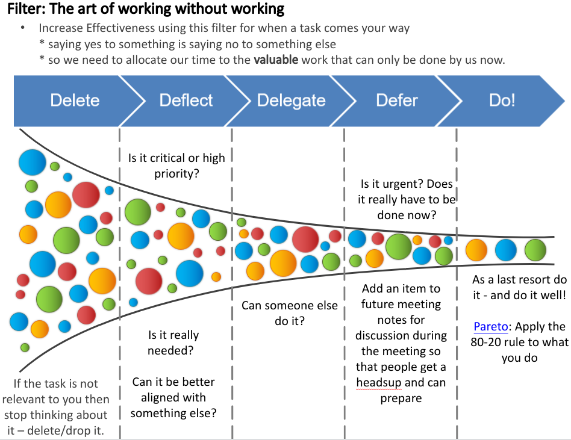
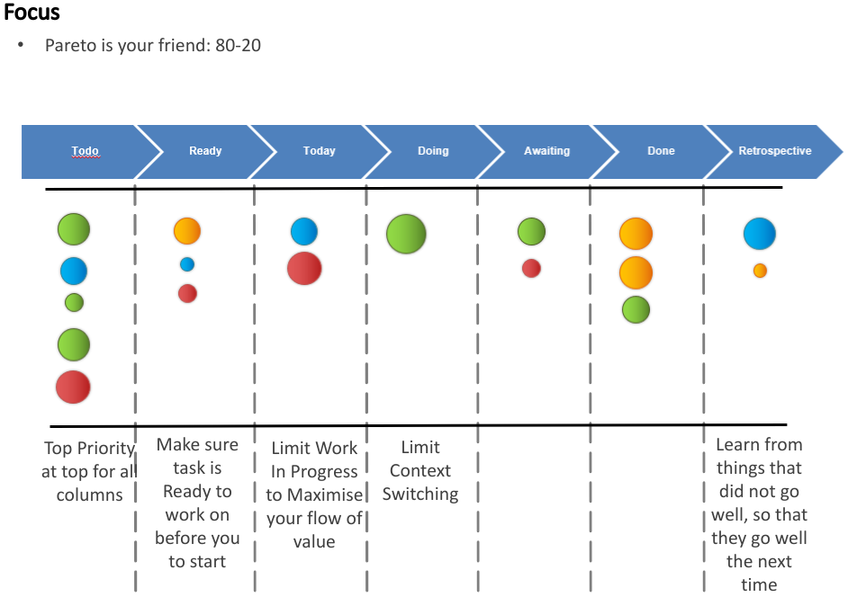

1. [Value Stream](#value-stream)
2. [Filter](#filter)
3. [Focus](#focus)
   1. [Agile](#agile)
   2. [Pareto](#pareto)
4. [Flow](#flow)
5. [Feedback](#feedback)

# Value Stream

>> "Your mental energy is your most valuable asset" so we need to spend it wisely 
(The Science of Intelligent Achievement: How Smart People Focus, Create and Grow Their Way to Success)

>> Don’t tell people what to do; tell them what you need accomplished, and you’ll be amazed at the results.
General George Patton

TODO: add section about your value streams
- life
- work

# Filter

- Each bubble is a task - the bigger the bubble the bigger the task. The different colours are tasks of different types or projects.
- Some tasks are small enough (e.g. < 3 minutes) that it's easier just to do them.
- This is largely based on the Getting Things Done: The Art of Stress-Free Productivity book.

>> "Simplicity—the art of maximizing the amount of work not done—is essential." —Agile Manifesto

>>"People think focus means saying yes to the thing you've got to focus on. But that's not what it means at all. It means saying no to the hundred other good ideas that there are. You have to pick carefully. I'm actually as proud of the things we haven't done as the things I have done. Innovation is saying no to 1,000 things.” 
Steve Jobs, Apple:
https://youtu.be/H8eP99neOVs

# Focus

## Agile
[Scrum](https://www.scruminc.com/definition-of-ready/)
  is used to ensure value - "huge amount of waste in system that needs to be pulled out" e.g. 60% of features not used

## Pareto

"In workplace productivity the distribution is noted in the amount of effort we put towards our goals: the first 20% of your time yields 80% of the results. And then you spend another 80% on the remaining 20%. For example, it might take a team 2 days to create a working webpage. It seems they are almost done, but then it takes them another 8 days to finish it off. They run into bugs to fix; polishing the design and copy takes more time than expected, testing it across browsers and devices may surface more bugs to fix, etc."

"The first 20% of the effort brings 80% of the results, the second 20% bring another 10%, the third 20% bring 3%, and the distribution continues. The farther you are in a project the less of the results it brings, so know when to stop."

# Flow
TODO Define flow

# Feedback
TODO add section on feedback