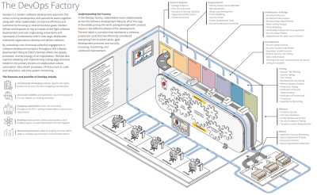

# Dev(Sec)Ops Thoughts from the Trenches 

## Presentation 
This [presentation](https://drive.google.com/open?id=1hoohALIkGIvd8eOvafHTSc0bjOeZT_To) is a tour of a Dev(Sec)Ops factory, highlighting some key points about each part.
It emphasises
- The end goal: Delivering Value by enabling the customer
- Continuity: the mainentance of continuous action and self-consistent detail is essentail across the parts 
- The earlier stages are the most important

The factory backdrop is taken from [CERT DevSecOps Model Building Secure Applications](https://resources.sei.cmu.edu/asset_files/Brochure/2018_015_001_521283.pdf)

