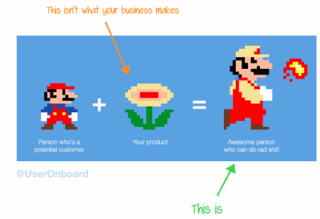
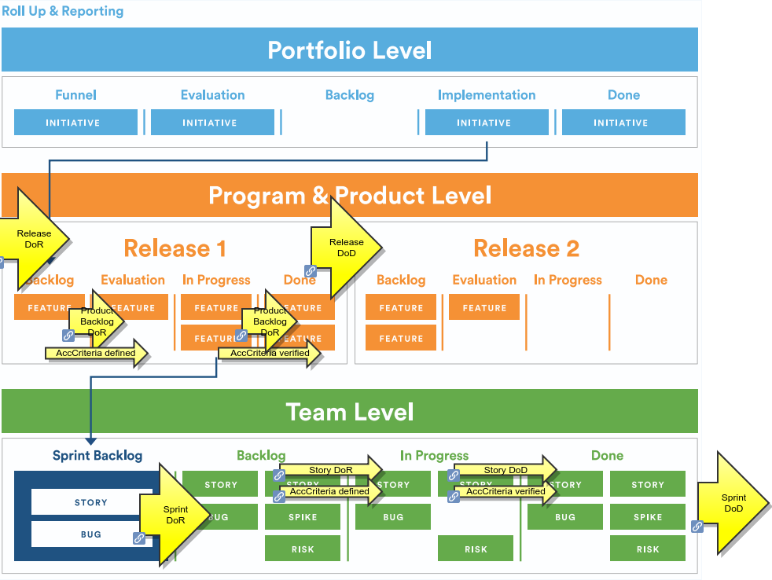
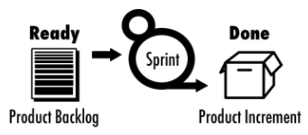
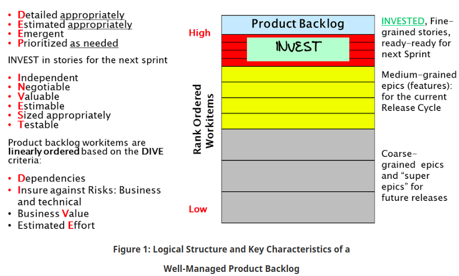

 # Deliver Value

An organisation delivers value to the customer through a timely efficient solution
- **value**: we deliver customer value - not hardware - not software - and not the things that have no value
- **timely**: on time but just in time e.g. not efficient to deliver stuff that is not needed or used for many months
- **efficient**: minimal functionality and effort required
- **solution**: - not a terminal ADK release - but all the things the customer needs to use the features

# Portfolio Product Team

A large organisation focused on delivering value can be represented at 3 levels per [SAFe](http://scaledagileframework.com)
1. Portfolio: Portfolio Backlog: Workstreams and Value Map
2. Product and Program: Product Backlog
3. Team: Sprint Backlog

# DoR, DoD, AC

> "Simplicity—the art of maximizing the amount of work not done—is essential." Agile Manifesto
> 
The following can be applied at multiple levels (Portfolio, Product and Sprint backlog) and to multiple things
1. Definition of Ready
2. Definition of Done
3. Acceptance Criteria

To enable teams to deliver customer value at end of each sprint, and eliminate wasteful activities, the following are required:
- A Definition of Ready, Definition of Done, and Acceptance Criteria for each item in the sprint (Sprint Backlog Item)
- A Definition of Ready, Definition of Done for the Sprint
- A Definition of Ready, Definition of Done, and Acceptance Criteria for each item in the Product Backlog
- A Definition of Ready, Definition of Done, and Acceptance Criteria for each item in the Portfolio Backlog

## Definition of Ready 
A generic checklist of conditions that must be true before a product backlog item is considered ready to pull into a sprint during sprint planning 
ref https://www.scruminc.com/definition-of-done/

https://www.youtube.com/watch?time_continue=1&v=XkhJDbaW0j0 
"a third of everything in their backlog had no value"...."the average company, more than a third of what they're building is junk" ..."the average % of features worldwide that is never really used is 65%" ..."so huge amount of waste in the system that needs to be pulled out"

1. it needs to be immediately actionable by the team - know what to do and need to be able to do something now
2. the Product Backlog is designed to be a negotiation between the Product Owner and the team - they want to talk about it
   1. might take less time - needs to be something that's been talked through before sprint planning
3. needs to have value - huge amount of waste in system that needs to be pulled out
4. estimatable
5. acceptance tests to tell when done
6. sized properly for the team

## Definition of Done
A generic checklist of the types of work that the team is expected to successfully complete by the end of the sprint, before it can declare its work to be potentially shippable. A bare minimum definition of done should yield a complete slice of product functionality, one that has been designed, built, integrated, tested, and documented and will deliver validated customer value 2. Sometimes described as the acceptance criteria that apply to all product backlog items.

The Definition of Done ensures everyone on the Team knows exactly what is expected of everything the Team delivers

see also https://www.scrumalliance.org/community/articles/2008/september/definition-of-done-a-reference which gives a very comprehensive 4column

## Acceptance Criteria
A Specific Definition of Done for a given User Story

# Definition of Ready for a Sprint Backlog Item

Definition of Ready for a Sprint Backlog Item is a generic checklist of conditions that must be true before a product backlog item is considered ready to pull into a sprint during sprint planning to become a sprint backlog item.

The scrum team determine if the Definition of Ready criteria are met or not - and they talk with the Product Owner to get items into a fit state.

Definition of Ready is not a stage gate. The basis of Agile is communication with stakeholders to deliver value.

The purpose is that the details are sufficiently understood by the development team so it can make an informed decision as to whether it can complete the task

1. Details traceable to source document (where appropriate) from Sprint Backlog Item
2. Requirements on documentation, specification, configuration, test, regression tests and architecture are clarified
3. The development team has a concrete idea of demonstrating and testing the user story

## Support Cases
A Support Case is also a work item that should be Independent with Dependencies defined

### Independent
A pre-triage has been done to ensure this is not a known fixed issue/defect

### Dependencies
 
When issues are reported, the following information should be provided
1. Detailed description of the problem
2. Affects Version: version of the s/w release
3. Impacted Platform / Device details (HW type, revision, etc.)
4. Additional information on environment (e.g. connected peripherals)
5. Expected vs. observed behavior
6. Steps to reproduce
   1. Tools used
   2. Equipment used
   3. Actions performed
7. Event timeline: Explanation on what happens when to correlate logs against bservations
8. Attachments
   1. logs
   2. Supplementary information (e.g. screen shots, videos)
   3. installation packages
   4. related code snippets (ideally, a small test app with source code that reproduces issue, on a specific device)
   5. specifications and test case descriptions

# Definition of Done for a Sprint Backlog Item

A generic checklist of the types of work that the team is expected to successfully complete by the end of the sprint, before it can declare its work to be potentially shippable. A bare minimum definition of done should yield a complete slice of product functionality, one that has been designed, built, integrated, tested, and documented and will deliver validated customer value 2. Sometimes described as the acceptance criteria that apply to all product backlog items.

The Definition of Done ensures everyone on the Team knows exactly what is expected of everything the Team delivers

The Product Owner determines if the Definition of Ready criteria are met or not - and they accept the work or not. Based on a demo, follow-on work can be identified for the Product Backlog.

> code done and tested at the feature level and there aren't any outstanding bugs
https://www.youtube.com/watch?v=Jlb195JT7hM

## Code Done
1. Code is peer-reviewed
2. Automated Code reviews
   1. Automated code review has been completed using the supported tools/technologies. Violations have been shared with the team and the team has resolved all discrepancies to adhere to the coding standard.
      1. Code Coverage
      2. Code Complexity
      3. Vulnerabilities
      4. Open Source License Compliance
      5. Test Coverage
      6. Dangerous apis
      7. Static Analysis / Dynamic Analysis
3. Design complete
   1. Design analysis is complete as per the user story or theme. UML diagrams are either created or updated for the feature under development.
4. Code Complete
   1. Source code changes are done for all the features in the “to do” list.” Source code has been commented appropriately.
5. Code Refactoring
   1. Source code has been refactored to make it comprehensive, maintainable and, amenable to change.
6. Code checkin
   1. Source code is checked in the code library with appropriate comments added.
7. Code merging and tagging
   1. Finalized source code has been merged with the main branch and tagged appropriately (merging and tagging guidelines are to be used)
   2. If any integration or build issues are found, the necessary steps are repeated and respective “Done” points are adhered to.
   3. Code complies with Coding standard

## Test Done
1. Unit testing is done
   1. Unit test cases have been executed and are working successfully
2. Feature is tested against acceptance criteria
   1. Feature passes regression testing
   2. Feature passes smoke test
3. Tests of backward compatibility passed
   1. Feature tested on all platforms
4. Functional testing done
5. Automated testing
   1. All types of automated test cases have been executed and a test report has been generated. All incidents/defects are reported.
6. Regression testing done
   1. Regression testing is done to ensure that defects have not been introduced in the unchanged area of the software
7. Performance testing done
   1. A common mistake is to not keep performance testing in the definition of done. This is an important aspect. Most performance issues are design issues and are hard to fix at a later stage
8. Acceptance testing done
   1. Each finished user story has been passed through UAT (User Acceptance Testing) and signed off as meeting requirements
9. Manual testing
   1.  Quality assurance team has reviewed the reports generated from automation testing and conducted necessary manual test cases to ensure that tests are passing. All incidents/defects are reported.

## Documentation 
1. Technical Documentation Created: Configuration parameters, flows, interface descriptions. Design Specification
2. User Guide Documentation for end user features - Update documentation in User Guides

> Documentation shoud be continuous and consistent and live close to the source code.

## Accepted by Product Owner
1. Demo done and verified
   1. Documentation Ready
   2. Doxygen added to public APIs
   3. Howto for entirely new feature
2. Feature ok-ed by User eXperience Owner (see Atlassian User eXperience Canvas Template)
3. Feature ok-ed by Product Owner

## Support Cases
1. Root cause is identified
2. Root cause is fixed
3. Preventative Test case is identified and a work item created to implement it

# Defintion of Ready for a Sprint

1. The Sprint Backlog is prioritized
2. The Spring Backlog contains all defects, User Stories and other work that the team is committing to
3. No hidden work
4. All team members have calculated their capacity for the Sprint
   1. Full-time on project = 6 hours per day (i.e. not 8 to allow 2 hours for All User Stories meet Definition of Ready
5. The Sprint Objective is specified - why are we doing this specific sprint.
6. Impacted Components identified

# Defintion of Done for a Sprint
1. Definition of Done and Acceptance Criteria for each item in the sprint are met
   1. All critical and blocker defects fixed; defects for the features developed, or defects committed for the sprint
   2. Tests passed
   3. Demo(s) approved
2. Product owner approval
   1. Each finished user story has been passed through UAT (User Acceptance Testing) and signed off as meeting requirements
3. Product Backlog updated
   1. All features not done during the sprint are added back to the product backlog. All incidents/defects not handled during the sprint are added to the product backlog
4. Project metrics are available: 
   1. Number of committed vs delivered Sprint Backlog items
   2. Pre-Sprint SBI Estimates
   3. Team Velocity
   4. Team Happiness score
   5. Burndown chart

# Definition of Ready for a Product Backlog Item
1. Product Owner Identified - This is the person who defines the Acceptance Criteria and accepts the end result
2. Acceptance Criteria Defined 
3. Roles and Responsibilities identified 

# Managing a Product Backlog

Product backlog is DEEP, INVEST SMART, and DIVE carefully

# SMART
Stories may be broken down into implementation tasks, such as Analysis, Design, Code Development, Unit Testing, Test Case Development, On-line Help, etc.  These tasks need to be SMART:

- S: Specific
- M: Measurable
- A: Achievable
- R: Relevant
- T: Time-boxed (typically small enough to complete in a single day)
  
If a story needs to take no more than N/4 staff-week of team effort (ex. 20 staff-hours for 2-week sprints), all SMART tasks in a story should add up to no more than N/4 staff-week of team effort.  If you have 5 tasks, each task on an average should take 4 hours of ideal time effort or less.

# DIVE
Product backlog items should be linearly ordered based on the DIVE criteria, which requires careful consideration of all four factors captured in the DIVE acronym:

- **D**ependencies: Even after minimizing the dependencies among stories or epics (which is always a good thing to do), there may still be few unavoidable dependencies and they will have an impact on rank ordering.  If workitem A depends on B, B needs to be rank-ordered higher than A.
- **I**nsure against Risks: Business as well as technical risks
- **B**usiness Value
- **E**stimated Effort

# DEEP
The granularity or size of work items should be determined based on how far into the future you are planning a product, i.e., the planning horizon. The longer or shorter the planning horizon, the larger or smaller the work items. This makes sense as it takes a lot more effort to develop, specify and maintain a large number of small-grain work items compared to developing, specifying and maintaining a small number of large-grain work items. Smaller work items, stories, are typically developed by breaking down larger work items, epics. Stories are the unit of software design, development and value delivery.

## DEEP product backlog 

A product backlog may have several hundred or more work items, hence the acronym DEEP. Work items can be comprised of stories, defects and test sets. DEEP is also an interesting acronym capturing the essence of the logical structure of a product backlog.

- **D**etailed appropriately: Workitems in the backlog are specified at an appropriate level of detail as summarized in Figure 1 and explained below.
- **E**stimated appropriately: workitems in the product backlog are estimated appropriately as explained below.
- **E**mergent: Product backlog is not frozen or static; it evolves or emerges on an on-going basis in response to product feedback, and changes in competitive, market and business. New backlog items are added, existing items are groomed (revised, refined, elaborated) or deleted or re-prioritized.
- **P**rioritized as needed: Workitems in the backlog are linearly rank-ordered as needed, as explained below.

# INVEST
[INVEST](https://en.wikipedia.org/wiki/INVEST_(mnemonic)) mnemonic is used for these: Independent, Negotiable, Valuable, Estimatable, Sized appropriately, Testable

| I **Independent**         | . At the specification level, stories are independent; they offer distinctly different functionality and don’t overlap.   . Moreover, at the implementation level these stories should also be as independent of each other as possible. However, sometimes certain implementation-level dependencies may be unavoidable   . Dependencies are identified and no external dependencies would block the PBI from being completed:      |
|-----------------------|---------------------------------------------------------------------------------------------------------------------------------------------------------------------------------------------------------------------------------------------------------------------------------------------------------------------------------------------------------------------------------------------------------------------------|
| N **Negotiable**          | Negotiable: Stories in the next sprint are always subject to negotiations and clarifications among product owner (business proxy) and the members of agile development team.   . The Stories are defined and written and reviewed and agreed with Product Owner                                                                                                                                                               |
| V **Valuable**            | . Each story for the next sprint offers clear value or benefit to either external users or customers (outside the development team), or to the team itself, or to a stakeholder. For most products and projects, most stories offer value to external users or customers   . Value of the feature and each associated sub-feature is challenged and justifi                                                                     |
| E **Estimatable**         | The item is estimated and small enough to comfortably be completed in one sprint.                                                                                                                                                                                                                                                                                                                                         |
| S **Sized Appropriately** | . Each story is Small enough to be completed and delivered in a single sprint.  . The exception is a spike "for activities such as research, design, investigation, exploration, and prototyping" where the unknowns are too big until some more work is done.   . Team is staffed appropriately to complete the PBI.                                                                                                              |
| T **Testable**            | . Acceptance criteria are clear and testable - and defined independently by a third party (e.g. Product Owner) where possible.   . This ensures the Non Functional Requirements: if any, are defined and testable: Performance criteria User eXperience (see Atlassian User eXperience Canvas Template)  . Demo: Scrum team understands how to demonstrate the PBI at the sprint review.   
|

# References
1. https://www.scrumalliance.org/learn-about-scrum/community-webinars/webinar-replays/collaboration-at-scale-webinar-series/defining-done,-ready,-and-no-for-distributed-teams 1hr video on DoD, DoR, Acceptance Criteria
2. https://www.mitchlacey.com/intro-to-agile/scrum/definition-of-done
3.  https://www.scrumalliance.org/community/articles/2008/september/definition-of-done-a-reference
4.  https://blog.versionone.com/product-backlog-is-deep-invest-wisely-and-dive-carefully/ gives a very good summary of methods to refine backlogs (where these methods are called out in the agile bibles e.g. "Essential Scrum"
5.  http://www.romanpichler.com/blog/category/product-roadmap/ where Roman Pichler is referenced from "Essential Scrum" and is responsible for DEEP and other significant contributions
    1.  https://www.romanpichler.com/blog/product-roadmap-vs-release-plan/
    2.  https://www.romanpichler.com/blog/product-roadmap-product-backlog/

