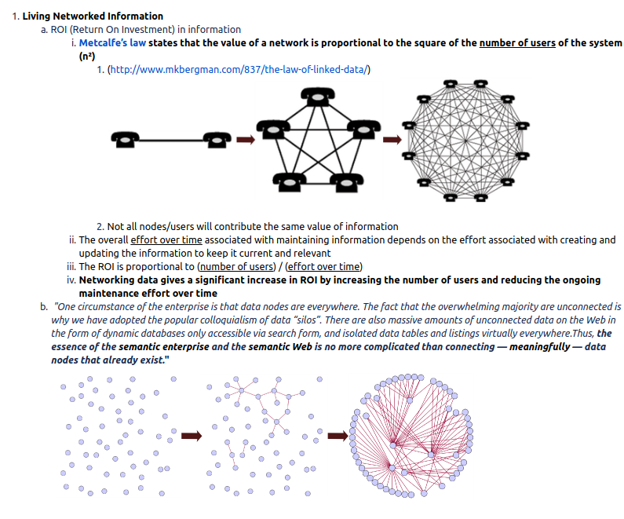
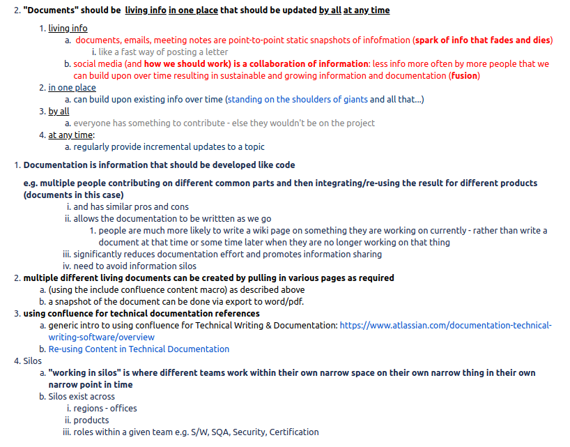
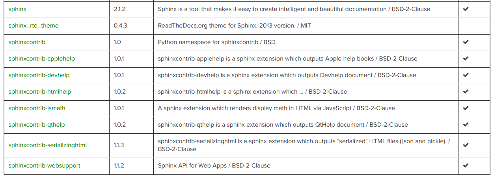
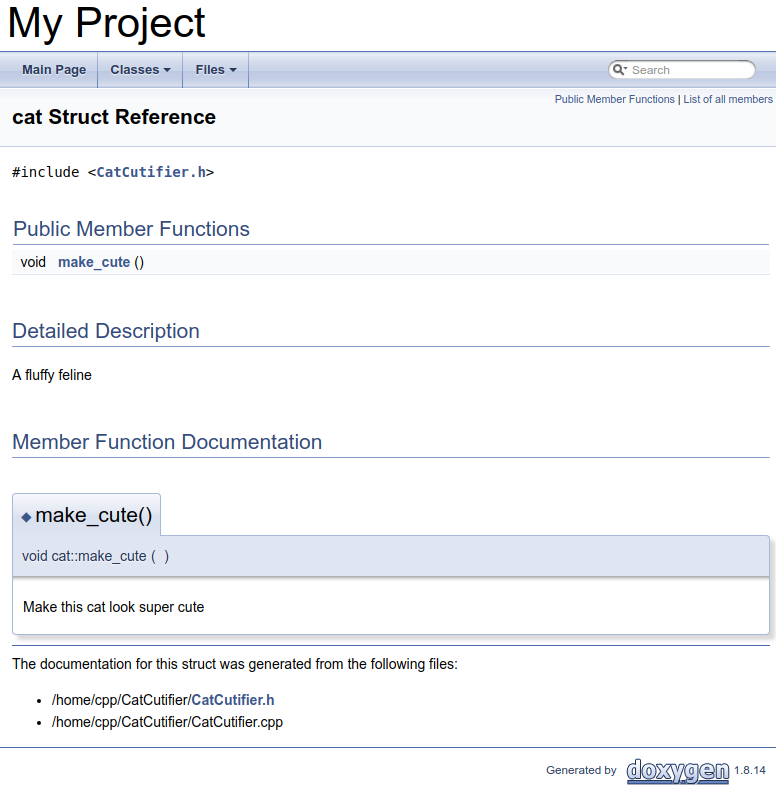
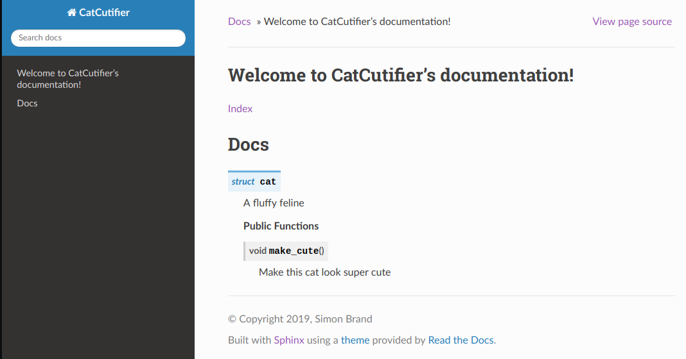
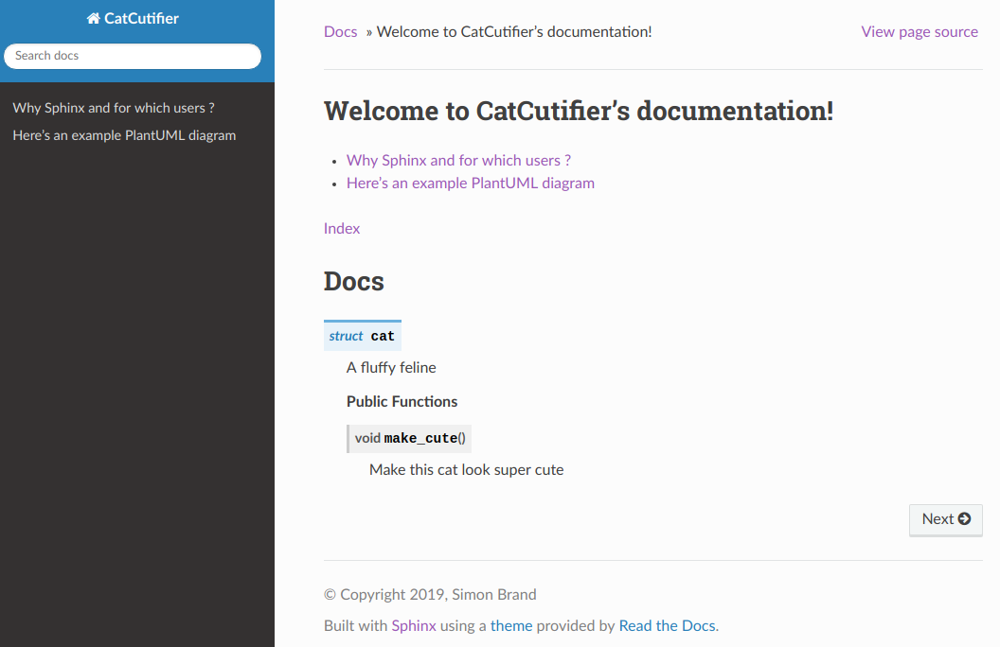
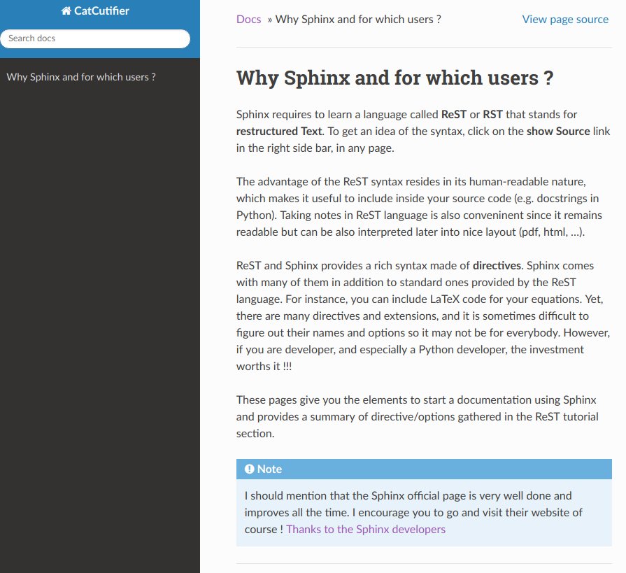
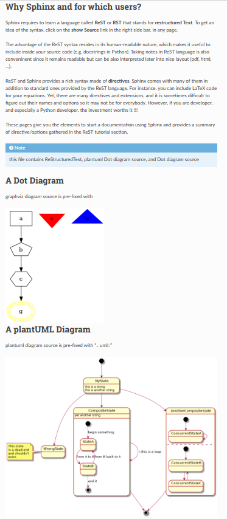

There are 2 types of documentation:
* describes the code - aimed at a developer of that code e.g. an API document
* describes how to use that code - e.g. a HowTo

Per linux/openssl guide, documents should describe what the code is supposed to do; not how it does it i.e. the documentation should not duplicate the code; instead complement it.

# Goals
Given a code base consisting of:
1. Code written in C, C++
2. Plantuml diagrams
3. Documentation written in a Wiki or Markup language

We want
1. To create documentation for users of the software - developers, and end-users.
2. For the documention to be pretty and modern looking
3. To support documentation extraction from C, C++ code and also standalone descriptive text files that include PlantUML diagrams.


# The Journey to Documentation as Code
The Journey to Documentation as Code began over a decago ago when either no documentation, or MS Word Documents were common. In more orgainised companies, these documents were maintained in MS Sharepoint.

## Sharepoint and MSWord Documents
Many years back, we made the transition from MS Word documents to Wikis - Living Documents. I was a strong proponent getting people from documents in sharepoint.





## Confluence
Today we use Confluence which makes it easy for everyone to add content or provide comments on it.
However, the content becomes stale and is disconnected from the code and software teams.

Many community projects use Confluence for user documentation e.g. Apache https://cwiki.apache.org/confluence/display/HTTPD/ which is a wiki containing user-contributed recipes, tips, and tricks for the Apache HTTP Server.


## Documentation as Code
We want move to Documentation as Code.


# Github

<p>
Github supports <a href="https://github.com/github/markup">several markup languages</a> for documentation; the most popular ones are Markdown and reStructuredText.
</p>

<table>
  <tr>
   <td>Markup
   </td>
   <td>Associated with / Origins
   </td>
   <td>Example Projects Using.
   </td>
  </tr>
  <tr>
   <td>Markdown
   </td>
   <td>Web content in general
   </td>
   <td>Static Site Generators with content in GitHub e.g. Gatsby
   </td>
  </tr>
  <tr>
   <td>RST reStructured Text
   </td>
   <td>Python
   </td>
   <td>The Linux kernel uses [Sphinx](http://www.sphinx-doc.org/) to generate pretty documentation from [reStructuredText](http://docutils.sourceforge.net/rst.html) files under Documentation
   </td>
  </tr>
  <tr>
   <td>POD Plain Old Documentation
   </td>
   <td>Perl
   </td>
   <td>Perl, OpenSSL
   </td>
  </tr>
  <tr>
   <td>ASCIIDoc
   </td>
   <td>General documentation
   </td>
   <td>
   </td>
  </tr>
  <tr>
   <td>Doxygen
   </td>
   <td>C, C++	Doxygen is a widely used system that generates documentation from annotated source code. Doxygen is heavily used for documenting C++ software.
   </td>
   <td>
   </td>
  </tr>
  <tr>
   <td>Rdoc
   </td>
   <td>Ruby
   </td>
   <td>
   </td>
  </tr>
</table>


[Bitbucket supports ](https://confluence.atlassian.com/bitbucket/wikis-221449748.html) Markdown, reStructured Text, Textile and Creole


# Toolset
We will use [Exhale](https://exhale.readthedocs.io/en/latest/usage.html#quickstart-guide) which is an automatic C++ library API generation utility. 

It imports [Doxygen](http://www.doxygen.nl/manual/index.html) output into the [Sphinx](http://sphinx-doc.org) domain (via a [Breathe](https://breathe.readthedocs.io/en/latest/) bridge). In other words, it Sphinx'ifies your C/C++ Doxygen ouput to allow you to apply all the power of Sphinx to it.


## Setup
In this example we will install the toolset in a Docker container - specifically Anaconda - but any container could be used.
Anaconda has Sphinx installed already:
 


The Toolset will operate on source files on a host directory which we share from host to container when we run the Toolset container.

Alternatively, Exhale can be installed directly on the host machine (along with all its dependencies), using the same "pip install exhale" command below.

On host:
```
docker pull continuumio/anaconda3 #install Anaconda Docker container

sudo docker run -i -t -v /home/chris_m11/work/DocumentationAsCode/cpp-documentation-example/:/home/cpp continuumio/anaconda3 /bin/bash # map host dir cpp-documentation-example/ to container /home/cpp/ dir
```

On Container:
```


pip install exhale

```
Installing Exhale will install all its dependencies: Doxygen, Breathe, Docker.

In this case, we uses Python's PIP installer, rather than Conda.
Ref https://www.anaconda.com/understanding-conda-and-pip/
“Occasionally a package is needed which is not available as a conda package but is available on PyPI and can be installed with pip. In these cases, it makes sense to try to use both conda and pip.”


## Make Docker Container Changes Persistent
Ctrl-p + Ctrl-q #detach from the container 

On Host:
```
sudo docker ps
sudo docker commit 5f7fd2273547 continuumio/anaconda

continuumio/anaconda3                               latest              5a29bf746e63        About a minute ago   2.7GB
continuumio/anaconda3                               <none>              cd83b04b8169        22 hours ago         2.6GB

sudo docker attach 5f7fd2273547

```


# Documentation Source
For demo purposes, we'll start with a project someone already made. 

On Host:
```
git clone git@github.com:TartanLlama/cpp-documentation-example.git
```

## Edit sphinx conf.py

```
extensions = [ "breathe",
              "exhale"
]


# Setup the exhale extension
exhale_args = {
    # These arguments are required
    "containmentFolder":     "./api",
    "rootFileName":          "library_root.rst",
    "rootFileTitle":         "Library API",
    "doxygenStripFromPath":  "..",
    # Suggested optional arguments
    "createTreeView":        True,
    # TIP: if using the sphinx-bootstrap-theme, you need
    # "treeViewIsBootstrap": True,
    "exhaleExecutesDoxygen": True,
    "exhaleDoxygenStdin":    "INPUT = ../CatCutifier"
}

```

```
# Breathe Configuration
breathe_default_project = "CatCutifier"

```


```
# Tell sphinx what the primary language being documented is.
primary_domain = 'cpp'

# Tell sphinx what the pygments highlight language should be.
highlight_language = 'cpp'

```

# Sphinx
This project came with a Sphinx conf.py. 
Alternatively, run sphinx-quickstart to create a new one.


On Host or Container: Make a build directory
```
mkdir build
```

Run Sphinx

```
sphinx-build -b html ./ build/

```

## Doxygen Output

html/ contains the Doxygen Output html:


## Sphinx Output
build/ contains the Sphinx Output html:



## Add a Descriptive Text file
We create a file intro.rst and plantuml in our docs directory.

Edit Index.rst to add the content of intro.rst and plantuml.rst to our html documentation; add intro and plantuml entries without the .rst file extension:
```
.. CatCutifier documentation master file, created by
   sphinx-quickstart on Wed Apr 24 15:19:01 2019.
   You can adapt this file completely to your liking, but it should at least
   contain the root `toctree` directive.

Welcome to CatCutifier's documentation!
=======================================

.. toctree::
   :maxdepth: 2
   
   intro
   plantuml
   :caption: Contents:
    
:ref:`genindex`

Docs
====
    
.. doxygenstruct:: cat
   :members:
```

Link to the page added:


The page content



# Plantuml
sphinxcontrib.plantuml requires plantuml which requires java and graphviz.

## Install Java

```
mkdir -p /usr/share/man/man1 # otherwise the java install will fail on docker!
apt-get update
apt-get upgrade
apt install default-jre
```

## Install Plantuml.jar
Download Plantuml.jar manually from plantuml.com
Copy plantuml.jar to e.g. /usr/local/bin/plantuml.jar
```
apt-get install graphviz # required by plantuml

java -jar /usr/local/bin/plantuml.jar -testdot
The environment variable GRAPHVIZ_DOT has been set to /usr/bin/dot
Dot executable is /usr/bin/dot
Dot version: dot - graphviz version 2.40.1 (20161225.0304)
Installation seems OK. File generation OK

echo "export GRAPHVIZ_DOT=/usr/bin/dot" >  /etc/profile.d/sphinx.sh
chmod +x /etc/profile.d/sphinx.sh 

```

  


### Install sphinxcontrib.plantuml 

```
pip install sphinxcontrib-plantuml
```

### Add plantuml and dot to Sphinx conf.py
```
extensions = [ "breathe",
              "exhale",
              "sphinxcontrib.plantuml",
              "sphinx.ext.graphviz"
]

plantuml = 'java -jar /usr/local/bin/plantuml.jar'

```


# Create Documentation with Rest, PlantUML diagrams, Dot diagrams
```
/home/cpp/docs#sphinx-build -b html ./ build/

```

In this case, we included the source code of the diagrams in the RST file. 
This results in image files being created in build/_images/.
It is better to have the diagram source separate and output to known image file names. 
This allows the image to be included multiple times, and to be rendered on GitHub, Bitbucket.





# ToDo
1. Use the Plantuml styling per https://daniel-siepmann.de/Posts/2016/06/11-read-the-docs-sphinx-plantuml-workflow.html#plantuml
2. change plantuml to output images of known name
3. add other icon libaries
4. publish docker container via compose


# References
1. https://docker.github.io/compose/install.md
2. https://build-me-the-docs-please.readthedocs.io/en/latest/Using_Sphinx/UsingGraphicsAndDiagramsInSphinx.html
3. https://daniel-siepmann.de/Posts/2016/06/11-read-the-docs-sphinx-plantuml-workflow.html#plantuml


