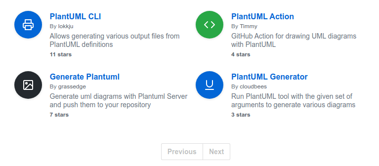

# Goal

Auto-generate and commit diagrams on diagram source commit to repo:

1. PlantUML source files *.puml are uploaded to a GitHub repo
2. This triggers the workflow associated with that repo for each file
3. Checkout source
4. Generate svg diagrams 
5. Generate png diagrams 
6. List source file and generated files
7. Commit files
8. Push new images to repo

# GitHub Actions

[Github Actions](https://help.github.com/en/actions)  *“Automate, customize, and execute your software development workflows right in your repository with GitHub Actions. You can discover, create, and share actions to perform any job you'd like, including CI/CD, and combine actions in a completely customized workflow.”*

## First Impressions

1. I like!
2. I went from knowing / having zero to something working next day.  
3. I learnt a lot about GitHub Actions in the last 24 hours - benefitting from diagnosing why existing actions did not work with my workflow e.g. https://github.com/cloudbees/plantuml-github-action/pull/3
4. Documentation and examples are pretty good.
5. I like that Docker can be used for the actions so this makes the solution portable.
6. Performance is reasonable - not as fast as a pre-built docker container running locally but fast enough to match my commit frequency.


## PlantUML GitHub Actions

There's several PlantUML Actions in the Github Marketplace.

https://github.com/marketplace?query=plantuml



PlantUML Generator looks to be the closest to what I want.

This ran but did not produce any output files.

After a bit of poking around it turned out to be how the environment variables were passed in the example workflow associated with this PlantUML Github action.
https://github.com/cloudbees/plantuml-github-action/pull/3

I then added a github push action - chosing the simplest one I found that did the job.

## Workflow

This is the first draft workflow. It meets the stated goal.

Other ideas/features will be tracked on the associated Github Project https://github.com/Crashedmind/PlantUMLGithubWorkFlow/projects/1

The workflow lives here https://github.com/Crashedmind/PlantUMLGithubWorkFlow. Snapshot below:

````

#https://help.github.com/en/actions/reference/workflow-syntax-for-github-actions#onpushpull_requestpaths

name: Generate PlantUML Diagrams 
on:
  push:
    paths:
      - '**.puml' #matches zero or more of any character

jobs:
  ci:
    runs-on: ubuntu-latest
    env:
        UML_FILES: ".puml"
    steps:
      - name: Checkout Source 
        uses: actions/checkout@v2
      
      - name: Get changed UML files
        id: getfile
        run: |
          echo "::set-output name=files::$(git diff-tree -r --no-commit-id --name-only ${{ github.sha }} | grep ${{ env.UML_FILES }} | xargs)"
      
      - name: UML files considered echo output
        run: |
          echo ${{ steps.getfile.outputs.files }}
      
      - name: Generate SVG Diagrams
        uses: cloudbees/plantuml-github-action@master
        with:
            args: -v -tsvg *${{ env.UML_FILES }}

      - name: Generate PNG Diagrams
        uses: cloudbees/plantuml-github-action@master
        with:
            args: -v -tpng *${{ env.UML_FILES }}
      
      - name: List files
        run: ls *${{ env.UML_FILES }}; ls *.svg; ls *.png      
      
      - name: Commit Changed Files
        run: |
          git config --local user.email "action@github.com"
          git config --local user.name "GitHub Action"
          git add --all
          git commit -m "Add changes" -a
      
      - name: Push Changed Files
        uses: ad-m/github-push-action@master
        with:
          github_token: ${{ secrets.GITHUB_TOKEN }}

````


# References
1. https://help.github.com/en/actions/getting-started-with-github-actions/core-concepts-for-github-actions
2. https://help.github.com/en/actions/building-actions/dockerfile-support-for-github-actions
3. https://help.github.com/en/actions/building-actions/creating-a-docker-container-action
4. https://help.github.com/en/actions/configuring-and-managing-workflows/configuring-a-workflow


 