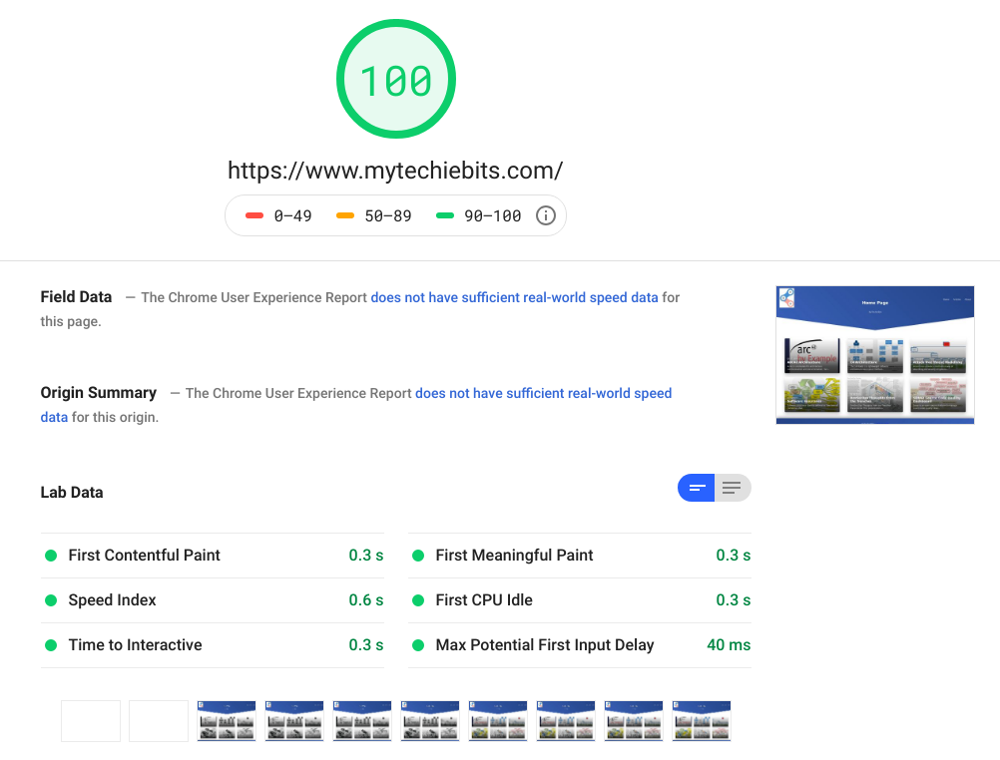

Decades ago (before [PHP](https://en.wikipedia.org/wiki/PHP)), I maintained a photo gallery website of personal images. 
The content was static i.e. no database or javascript.
I wrote some Perl scripts to resize the images (main and thumbnails) and to create the associated HTML. It worked well; drop some images in a directory, script created the content, content was published to net. Simple and Secure.

Then came PHP and various photo gallery software like [Coppermine](https://coppermine-gallery.net/), and various CMSs (Wordpress, Joomla, Drupal). More functionality and complexity and less security.

> what's old is new again

Fast forward to today... Static Site Generation is now a (big) [thing](https://www.staticgen.com/). 

One popular option is to render MarkDown (or AsciiDoc) content from github. 
There are many tools to do this: I chose Gatsby because it uses GraphQL + React, and has a large growing community around it.

# JAM Stack
This follows the general https://jamstack.org/ paradigm
- **J**avaScript running entirely on the client side e.g. React
- **A**PIs accessed over HTTP with JavaScript 
- **M**arkup Markup prebuilt from e.g. Markdown using a SSG e.g. Gatsby

 Some benefits are security, speed, and versioned content in Git. And no database unlike a LAMP or MEAN stack.

# Speed

*(As at June 20 2019)*

https://developers.google.com/speed/pagespeed/insights/?url=https%3A%2F%2Fwww.mytechiebits.com&tab=desktop

# Netlify Deployment Pipeline
Netlify is used to
1. generate site static content based on github commits
2. host the content
3. support builds from any commit, rollback, and other useful features
4. support TLS 

# Alternatives
Github offers [GitHub Pages](https://pages.github.com/).

In addition to supporting regular HTML content, GitHub Pages [support Jekyll](https://help.github.com/en/articles/using-jekyll-as-a-static-site-generator-with-github-pages)  static site generator.
