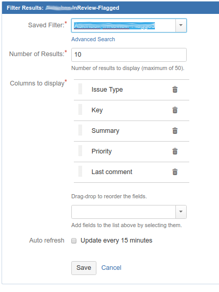
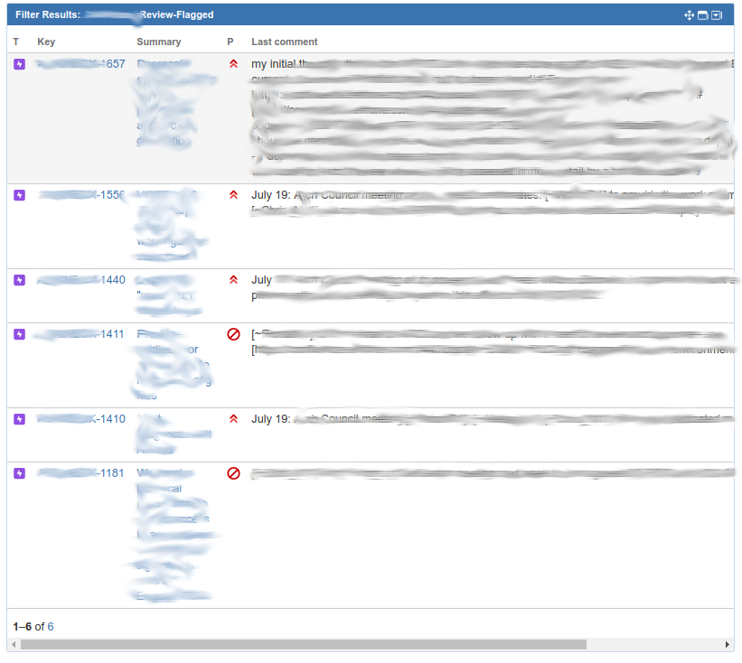

JIRA queries unleash the full power of JIRA.
Below is a living list of some useful queries.


## Find Issues That I Updated Recently
```
issueFunction in lastUpdated("by currentUser()") AND updated >= -15d 
```

## Find Only Open Issues That I Updated Recently
```
issueFunction in lastUpdated("by currentUser()") AND updated >= -15d AND status not in (Closed, Resolved, "On Hold") ORDER BY updated DESC
```


## Find all issues in a user story that Feature Links to the sub-tickets
issueFunction in linkedIssuesOf("issue =PROJECT-1234")


## Bulk Create

1. Jira - issues - import issues from CSV
2. select the file jira.csv
3. select project: MYPROJECT
4. Summary → Jira field (Summary)
5. Validate
6. Begin Import
7. this creates the item tickets e.g. stories

## A board filter that removes any tickets that are part of an epic from a specific project  (MYINBOX)
```
project in ("MYSUBPROJECT") AND status not in (Closed, Resolved, Delivered, "In Verification", Integration) and not issuefunction in linkedIssuesOf("project = MYINBOX and type = Epic", "is Epic of")
```

## Meeting notes from JIRA ticket comments
Applying the principle *"any information related to a ticket should be in the ticket"*, the meeting notes, updates, actions relevant to a specific ticket should be in that ticket (rather than sending meeting notes in a confluence page or email etc...).

We can then use JIRA dashboard to generate the collated meeting notes automatically from the last comments in the relevant tickets.
1. Create a filter to list flagged tickets
2. open jira Dashboard
3. Add Gadget "filter results"
4. Select filter to list the flagged tickets
5. Add "Last Comment" to "Columns to display". 8. This creates a table of tickets by name and number with the last comment (your meeting notes)




Before meeting: Flag items that are to be discussed in the meeting. On a Kanban Board, right click to flag/unflag tickets

During meeting: Add a comment to the relevant jira ticket(s) with the meeting updates

After meeting: CopyNpaste the dashboard "Last Comment" report and post via email/Confluence





