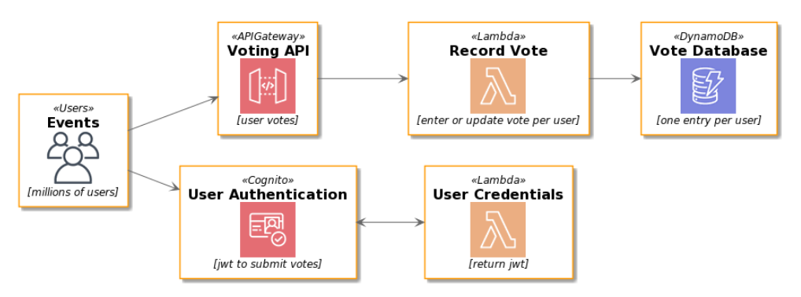
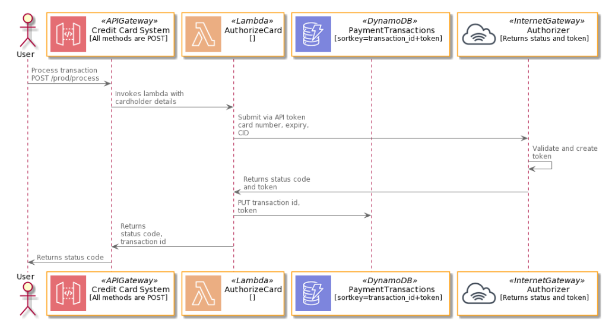
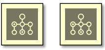
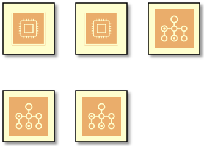
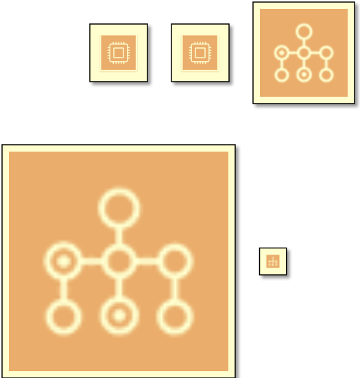

# Background

[PlantUML Standard Library](https://plantuml.com/stdlib) includes several icon libraries from different sources (including myself) and they are varied in functionality and how to use them. 

The most recent addition is [https://github.com/awslabs/aws-icons-for-plantuml](https://github.com/awslabs/aws-icons-for-plantuml).

[https://github.com/awslabs/aws-icons-for-plantuml](https://github.com/awslabs/aws-icons-for-plantuml)  (Amazon) builds on the work of [https://github.com/RicardoNiepel](https://github.com/RicardoNiepel) (MicroSoft):

1. h[ttps://github.com/RicardoNiepel/Azure-PlantUML](https://github.com/RicardoNiepel/Azure-PlantUML)
2. [https://github.com/RicardoNiepel/C4-PlantUML](https://github.com/RicardoNiepel/C4-PlantUML) which builds on [https://c4model.com/](https://c4model.com/)
    1. These in turn build on 
        1. [https://github.com/milo-minderbinder/AWS-PlantUML](https://github.com/milo-minderbinder/AWS-PlantUML)
        2. [https://github.com/Roemer/plantuml-office](https://github.com/Roemer/plantuml-office)


# Goal

1. Look under the hood of the generated plantuml icon files from [https://github.com/awslabs/aws-icons-for-plantuml](https://github.com/awslabs/aws-icons-for-plantuml) to understand them better - from first principles e.g. [https://github.com/awslabs/aws-icons-for-plantuml/blob/master/dist/Compute/Batch.puml](https://github.com/awslabs/aws-icons-for-plantuml/blob/master/dist/Compute/Batch.puml)
2. To confirm understanding
   1. a new bare-minimum macro will be created that requires only 1 parameter !define Batch(e_alias)
   2. a new macro will be added to allow scaling the icon size


Example image from icons from AWSlabs icon files [https://github.com/awslabs/aws-icons-for-plantuml]


# Example Puml file from PlantUML Stdlib 

[https://github.com/awslabs/aws-icons-for-plantuml/blob/master/dist/Compute/Batch.puml](https://github.com/awslabs/aws-icons-for-plantuml/blob/master/dist/Compute/Batch.puml) content:

````
' Copyright 2019 Amazon.com, Inc. or its affiliates. All Rights Reserved.

' SPDX-License-Identifier: CC-BY-ND-2.0 (For details, see https://github.com/awslabs/aws-icons-for-plantuml/blob/master/LICENSE)

sprite $Batch [64x64/16z] {

xLQ7bjim30CdzFzVtEV1iErPkJpT7iYm5aWDKERujFZ5Bp8YkSvM011VfMzSDy2Mw1JidbCGAtmllmbPuIkoImjyGUsyBV4LV95_Xny50bpW4uTRAjOKu81bXa0vbX3OKFG5C0IMNLyxXA_3PvW5hqHSOFBP_Ovk4036hYi0pJdTCgqD6A0g4FQ0hOwygxSikGOanw11AuvtomxXjNiRDECmn21xxTkJP0N4tdy1Gmu5T2GW6ygFL_sqbx3NvA_FVtt_ri_F1CZNra-10TpNhvVr2KGcyVCOdoBySlpv-jC1ZSVveO36_Fwb0UASqGqG0QpfJgP2Eo60u59-fLVozhhdNk2WTeDpq2O6AAL_uV7KGPNO2lya17gz1pMiD1VmFNH9IBLNe3xA3q07eNsMy_WdXESwU4jRmddEk-FUuPFjjthiqAEGVUz8rlqmsK1nhtYlklvp7vWRfka0jUNITUdTzgxFyzLx-Ikh_YdmYr_y0G

}

AWSEntityColoring(Batch)

!define Batch(e_alias, e_label, e_techn) AWSEntity(e_alias, e_label, e_techn, #D86613, Batch, Batch)

!define Batch(e_alias, e_label, e_techn, e_descr) AWSEntity(e_alias, e_label, e_techn, e_descr, #D86613, Batch, Batch)

!define BatchParticipant(p_alias, p_label, p_techn) AWSParticipant(p_alias, p_label, p_techn, #D86613, Batch, Batch)

!define BatchParticipant(p_alias, p_label, p_techn, p_descr) AWSParticipant(p_alias, p_label, p_techn, p_descr, #D86613, Batch, Batch)

````

## Similar
The layout looks similiar to e.g. https://github.com/RicardoNiepel/Azure-PlantUML/blob/master/dist/AIMachineLearning/AzureBatchAI.puml

````
sprite $AzureBatchAI [70x70/16z] {
rPO5ijjG301NQFV-1oxfZoidVWgKTo3e7T431iJCNG3FS1DUHpsB0DsBz9TCKegJfKXxnz4jnVQSnp9NbYA5XqHEba9XnlEn9L56v8bO4cQD0Z5RIZ8bPIc7nZLEbasZIVQD9PcfWAShO2UB0nebgSz3PLiRvMHHYYD1MOTIqHnBeDSbZIxPOnotQ8fcEKJR_i4uRmQsx963ZxCdMGZ4qhA1x5DAUZmbmxm8R8Vn0cy9hIqzfQ4i0Z5ODf2fC5cOI5vQFX8HEMAnbQLZs0zB2lij_em5mCfIw-ijIwMje08W-PObGpcG5ibiMNcwesFpXYjgX-TKaJHjFfrtN93hUGdm_O0BzFJWjIN1sW1UqH-qQylMFnXCAVdIilSFC0PZu4kBj3vFmOIiBG9n28TWN63g4M1PLLcWhb38bSNRjO8r5OSvGDnP3B2quu-3HgCUBKstADJCXKwM5a4ASBOu44TK0xqUSX5BNZPvN0ZtTTds8d_5ZMpZ6Vo1HNYA62tAasHXtP9vqPuHQKkxBAd8SDyOAbpl0ZGL81ULdKiJIaDYo6UOckwH62Pb2gPv9AR-pC4KthQtv5MkviLu5R-my39wRqbUvzxYlyHYl4xSMVHjI--qy0Rw3G4G_Gx_ERBT4Bo1VhhXlxTWDoZ_ExwTSDuZtwzjPpiSky5FQtPbv0i
}

AzureEntityColoring(AzureBatchAI)
!define AzureBatchAI(e_alias, e_label, e_techn) AzureEntity(e_alias, e_label, e_techn, AZURE_SYMBOL_COLOR, AzureBatchAI, AzureBatchAI)
!define AzureBatchAI(e_alias, e_label, e_techn, e_descr) AzureEntity(e_alias, e_label, e_techn, e_descr, AZURE_SYMBOL_COLOR, AzureBatchAI, AzureBatchAI)

````

The BatchParticipant part supports adding icons to sequence diagrams i.e.
````
!define BatchParticipant(p_alias, p_label, p_techn) AWSParticipant(p_alias, p_label, p_techn, #D86613, Batch, Batch)
````


## Different

The puml file is quite different than e.g. https://github.com/plantuml/plantuml-stdlib/blob/master/material/currency_rub.puml

The sprite size is different (though uses the maximum 16 shades too).

The macros are completely different - so how the user uses them will be different i.e. not very user friendly to the use who just wants to use different icons and does not know or care about any of this stuff.

````
sprite $ma_currency_rub [48x48/16] {
000000000000000000000000000000000000000000000000
000000000000000000000000000000000000000000000000
000000000000000000000000000000000000000000000000
000000000000000000000000000000000000000000000000
000000000000000000000000000000000000000000000000
000000000000000000000000000000000000000000000000
00000000000000FFFFFFFFFFFFFFFFD94000000000000000
00000000000000FFFFFFFFFFFFFFFFFFFC20000000000000
00000000000000FFFFFFFFFFFFFFFFFFFFE3000000000000
00000000000000FFFFFFFFFFFFFFFFFFFFFE200000000000
00000000000000FFFF0000000000004BFFFFC00000000000
00000000000000FFFF000000000000007FFFF40000000000
00000000000000FFFF000000000000000BFFF90000000000
00000000000000FFFF0000000000000004FFFD0000000000
00000000000000FFFF0000000000000000FFFF0000000000
00000000000000FFFF0000000000000000FFFF0000000000
00000000000000FFFF0000000000000004FFFD0000000000
00000000000000FFFF000000000000000BFFF90000000000
00000000000000FFFF000000000000007FFFF40000000000
00000000000000FFFF0000000000004BFFFFB00000000000
000000000000FFFFFFFFFFFFFFFFFFFFFFFE200000000000
000000000000FFFFFFFFFFFFFFFFFFFFFFE3000000000000
000000000000FFFFFFFFFFFFFFFFFFFFFB20000000000000
000000000000FFFFFFFFFFFFFFFFFFD94000000000000000
00000000000000FFFF000000000000000000000000000000
00000000000000FFFF000000000000000000000000000000
00000000000000FFFF000000000000000000000000000000
00000000000000FFFF000000000000000000000000000000
000000000000FFFFFFFFFFFFFFFFFF000000000000000000
000000000000FFFFFFFFFFFFFFFFFF000000000000000000
000000000000FFFFFFFFFFFFFFFFFF000000000000000000
000000000000FFFFFFFFFFFFFFFFFF000000000000000000
00000000000000FFFF000000000000000000000000000000
00000000000000FFFF000000000000000000000000000000
00000000000000FFFF000000000000000000000000000000
00000000000000FFFF000000000000000000000000000000
00000000000000FFFF000000000000000000000000000000
00000000000000FFFF000000000000000000000000000000
00000000000000FFFF000000000000000000000000000000
00000000000000FFFF000000000000000000000000000000
00000000000000FFFF000000000000000000000000000000
00000000000000FFFF000000000000000000000000000000
000000000000000000000000000000000000000000000000
000000000000000000000000000000000000000000000000
000000000000000000000000000000000000000000000000
000000000000000000000000000000000000000000000000
000000000000000000000000000000000000000000000000
000000000000000000000000000000000000000000000000
}

!define MA_CURRENCY_RUB(_color)                                 SPRITE_PUT(                                   ma_currency_rub, _color)
!define MA_CURRENCY_RUB(_color, _scale)                         SPRITE_PUT(                                   ma_currency_rub, _color, _scale)
!define MA_CURRENCY_RUB(_color, _scale, _alias)                 SPRITE_ENT(  _alias, MA CURRENCY_RUB,         ma_currency_rub, _color, _scale)
!define MA_CURRENCY_RUB(_color, _scale, _alias, _shape)         SPRITE_ENT(  _alias, MA CURRENCY_RUB,         ma_currency_rub, _color, _scale, _shape)
!define MA_CURRENCY_RUB(_color, _scale, _alias, _shape, _label) SPRITE_ENT_L(_alias, MA CURRENCY_RUB, _label, ma_currency_rub, _color, _scale, _shape)
skinparam folderBackgroundColor<<MA CURRENCY_RUB>> White
````

https://github.com/plantuml/plantuml-stdlib/blob/master/tupadr3/devicons/android.puml

Different macros again here for this icon set.

````
@startuml
sprite $android [48x48/16] {
000000000000000000000000000000000000000000000000
000000000000000230000000000000050000000000000000
0000000000000001D00000000000001D0000000000000000
000000000000000087000000000000A50000000000000000
00000000000000000D127ACDDCA623C00000000000000000
00000000000000000AFFFFFFFFFFFF800000000000000000
0000000000000004EFFFFFFFFFFFFFFD3000000000000000
000000000000007FFFFFFFFFFFFFFFFFF500000000000000
00000000000007FFFFFFFFFFFFFFFFFFFF50000000000000
0000000000003FFFF41EFFFFFFFFD15FFFF2000000000000
000000000000CFFFF20DFFFFFFFFC03FFFFA000000000000
000000000004FFFFFFEFFFFFFFFFFDFFFFFF200000000000
000000000008FFFFFFFFFFFFFFFFFFFFFFFF600000000000
00000000000BFFFFFFFFFFFFFFFFFFFFFFFF900000000000
00000000000CFFFFFFFFFFFFFFFFFFFFFFFFA00000000000
000000000009BBBBBBBBBBBBBBBBBBBBBBBB700000000000
000002BD80023333333333333333333333332008DB200000
00000EFFF90DFFFFFFFFFFFFFFFFFFFFFFFFB09FFFE00000
00005FFFFF0DFFFFFFFFFFFFFFFFFFFFFFFFB0FFFFF50000
00007FFFFF2DFFFFFFFFFFFFFFFFFFFFFFFFB3FFFFF70000
00008FFFFF3DFFFFFFFFFFFFFFFFFFFFFFFFB3FFFFF80000
00008FFFFF3DFFFFFFFFFFFFFFFFFFFFFFFFB3FFFFF80000
00008FFFFF3DFFFFFFFFFFFFFFFFFFFFFFFFB3FFFFF80000
00008FFFFF3DFFFFFFFFFFFFFFFFFFFFFFFFB3FFFFF80000
00008FFFFF3DFFFFFFFFFFFFFFFFFFFFFFFFB3FFFFF80000
00008FFFFF3DFFFFFFFFFFFFFFFFFFFFFFFFB3FFFFF80000
00008FFFFF3DFFFFFFFFFFFFFFFFFFFFFFFFB3FFFFF80000
00008FFFFF3DFFFFFFFFFFFFFFFFFFFFFFFFB3FFFFF80000
00008FFFFF3DFFFFFFFFFFFFFFFFFFFFFFFFB3FFFFF80000
00008FFFFF3DFFFFFFFFFFFFFFFFFFFFFFFFB3FFFFF80000
00007FFFFF2DFFFFFFFFFFFFFFFFFFFFFFFFB2FFFFF70000
00005FFFFF0DFFFFFFFFFFFFFFFFFFFFFFFFB0FFFFF40000
00000DFFF80DFFFFFFFFFFFFFFFFFFFFFFFFB08FFFC00000
0000018B600DFFFFFFFFFFFFFFFFFFFFFFFFB006B8100000
00000000000DFFFFFFFFFFFFFFFFFFFFFFFFB00000000000
00000000000CFFFFFFFFFFFFFFFFFFFFFFFFA00000000000
000000000007FFFFFFFFFFFFFFFFFFFFFFFF500000000000
000000000000AFFFFFFFFFFFFFFFFFFFFFF8000000000000
0000000000000255BEEEEE6556EEEEEB5410000000000000
00000000000000009FFFFF1001FFFFFA0000000000000000
00000000000000009FFFFF1001FFFFFA0000000000000000
00000000000000009FFFFF1001FFFFFA0000000000000000
00000000000000009FFFFF1001FFFFFA0000000000000000
00000000000000009FFFFF1001FFFFFA0000000000000000
00000000000000008FFFFF0000FFFFF80000000000000000
00000000000000004FFFFC0000CFFFF40000000000000000
000000000000000009FFE300002EFFA00000000000000000
000000000000000000351000000153000000000000000000
}


!define DEV_ANDROID(_alias) ENTITY(rectangle,black,android,_alias,DEV ANDROID)
!define DEV_ANDROID(_alias, _label) ENTITY(rectangle,black,android,_label, _alias,DEV ANDROID)
!define DEV_ANDROID(_alias, _label, _shape) ENTITY(_shape,black,android,_label, _alias,DEV ANDROID)
!define DEV_ANDROID(_alias, _label, _shape, _color) ENTITY(_shape,_color,android,_label, _alias,DEV ANDROID)
skinparam folderBackgroundColor<<DEV ANDROID>> White
@enduml
````

## Obsevervations

1. There's no way to scale the icons from the macros (the !define statements). Plantuml does support scaling per https://forum.plantuml.net/4267/scaling-of-the-sprites-or-images. Support for scaling stereotypes is available since [March 2019](https://forum.plantuml.net/4267/scaling-of-the-sprites-or-images?show=9086#c9086). 
2. At least 3 parameters are required and are rendered in the diagams "!define Batch(e_alias, e_label, e_techn)". 
   1. So if we wanted a colored or scaled icon only (with no label or technology), the only option is to use the raw sprite (more on that later).
3. The PlantUML Stdlib lacks consistency and therefore user friendliness

# Steps to Understanding

Note Each puml file can be converted to png image:

````
java -jar plantuml.jar filename.puml #this outputs filename.png
````

## Step 1: Using the sprite directly

"Batch" is defined in https://github.com/awslabs/aws-icons-for-plantuml/blob/master/dist/Compute/Batch.puml) ala 
````
sprite $Batch [64x64/16z] {...

````

````
@startuml 

!include ./AWSCommon.puml
!include ./Compute/Batch.puml

rectangle "<$Batch>" 

'NOTE that if we add a more than one call - nothing happens! We're missing an "as x"
rectangle "<$Batch>" 

@enduml
````


## Step 2 Add an “as whatever”

````
@startuml 

!include ./AWSCommon.puml
!include ./Compute/Batch.puml

rectangle "<$Batch>" 

'NOTE that if we add a more than one call - nothing happens! Need to change the second one to "as whateverElse"
rectangle "<$Batch>" as whatever
rectangle "<$Batch>" as whatever
@enduml
````




## Step 3 Bare Minimum

Extract the sprite from the Batch.puml

Note that plantuml needs the @startuml and @endumlto recognize the file as a plantuml diagram i.e. it won’t work without these

````
@startuml

sprite $Batch [64x64/16z] {
xLQ7bjim30CdzFzVtEV1iErPkJpT7iYm5aWDKERujFZ5Bp8YkSvM011VfMzSDy2Mw1JidbCGAtmllmbPuIkoImjyGUsyBV4LV95_Xny50bpW4uTRAjOKu81bXa0vbX3OKFG5C0IMNLyxXA_3PvW5hqHSOFBP_Ovk4036hYi0pJdTCgqD6A0g4FQ0hOwygxSikGOanw11AuvtomxXjNiRDECmn21xxTkJP0N4tdy1Gmu5T2GW6ygFL_sqbx3NvA_FVtt_ri_F1CZNra-10TpNhvVr2KGcyVCOdoBySlpv-jC1ZSVveO36_Fwb0UASqGqG0QpfJgP2Eo60u59-fLVozhhdNk2WTeDpq2O6AAL_uV7KGPNO2lya17gz1pMiD1VmFNH9IBLNe3xA3q07eNsMy_WdXESwU4jRmddEk-FUuPFjjthiqAEGVUz8rlqmsK1nhtYlklvp7vWRfka0jUNITUdTzgxFyzLx-Ikh_YdmYr_y0G
}
@enduml
````


### Step 3.1 Bare Minimum by including Batch.puml

The result is the same.

````
@startuml 


!include ./AWSCommon.puml
!include ./Compute/Batch.puml


@enduml

````


### Step 3.2 Illegal Bare Minimum by including all.puml

Note: This is not valid plantuml as it does not contain any elements. 
* The VSCode Plantuml extension will happily render this in preview mode. But VSCode Plantuml extension export will fail
* Plantuml call will generate a blank output.

````
java -jar ~/system/plantuml.jar dist/all.puml

````


````
@startuml 

!include ./AWSCommon.puml
!include ./Compute/all.puml

@enduml

````


## Step 4 Where did that guy come from?

If any color is added we get an actor (from Deployment Diagram so can explicitly use a rectangle as the Deployment Diagram entity - see next example)

````
@startuml 


sprite $Batch [64x64/16z] {
xLQ7bjim30CdzFzVtEV1iErPkJpT7iYm5aWDKERujFZ5Bp8YkSvM011VfMzSDy2Mw1JidbCGAtmllmbPuIkoImjyGUsyBV4LV95_Xny50bpW4uTRAjOKu81b
Xa0vbX3OKFG5C0IMNLyxXA_3PvW5hqHSOFBP_Ovk4036hYi0pJdTCgqD6A0g4FQ0hOwygxSikGOanw11AuvtomxXjNiRDECmn21xxTkJP0N4tdy1Gmu5T2GW
6ygFL_sqbx3NvA_FVtt_ri_F1CZNra-10TpNhvVr2KGcyVCOdoBySlpv-jC1ZSVveO36_Fwb0UASqGqG0QpfJgP2Eo60u59-fLVozhhdNk2WTeDpq2O6AAL_
uV7KGPNO2lya17gz1pMiD1VmFNH9IBLNe3xA3q07eNsMy_WdXESwU4jRmddEk-FUuPFjjthiqAEGVUz8rlqmsK1nhtYlklvp7vWRfka0jUNITUdTzgxFyzLx
-Ikh_YdmYr_y0G
}

"<color:red><$Batch></color>"

@enduml
````


### Step 4.1 Lose the guy - add a Deployment Diagram Rectangle Instead

````
@startuml

sprite $Batch [64x64/16z] {
xLQ7bjim30CdzFzVtEV1iErPkJpT7iYm5aWDKERujFZ5Bp8YkSvM011VfMzSDy2Mw1JidbCGAtmllmbPuIkoImjyGUsyBV4LV95_Xny50bpW4uTRAjOKu81b
Xa0vbX3OKFG5C0IMNLyxXA_3PvW5hqHSOFBP_Ovk4036hYi0pJdTCgqD6A0g4FQ0hOwygxSikGOanw11AuvtomxXjNiRDECmn21xxTkJP0N4tdy1Gmu5T2GW
6ygFL_sqbx3NvA_FVtt_ri_F1CZNra-10TpNhvVr2KGcyVCOdoBySlpv-jC1ZSVveO36_Fwb0UASqGqG0QpfJgP2Eo60u59-fLVozhhdNk2WTeDpq2O6AAL_
uV7KGPNO2lya17gz1pMiD1VmFNH9IBLNe3xA3q07eNsMy_WdXESwU4jRmddEk-FUuPFjjthiqAEGVUz8rlqmsK1nhtYlklvp7vWRfka0jUNITUdTzgxFyzLx
-Ikh_YdmYr_y0G
}

rectangle "<$Batch>"

@enduml
````


## Step 5 Add some color

````
@startuml 

!include ./AWSCommon.puml
!include ./Compute/Batch.puml

rectangle "<$Batch>" 

'this overides/specifies a color as red
rectangle "<color:red><$Batch></color>"
@enduml

````


## Step 6 Understanding the AWSEntity Macro

Based on reconstructing the existing Macros, we can define our own minimal macro:
````
!define Batch(e_alias) AWSEntity(Batch, #D86613) as e_alias
````
where the parameters are
1. Batch - this refers to the sprite $Batch
2. e_alias - this adds on a "as whatever" so multiple calls to same sprite return multiple rendered icons.
"#D86613" is the color defined as part of the sprite puml file


````
@startuml 

!include ./AWSCommon.puml
!include ./Compute/Batch.puml
!include ./Compute/Compute.puml


'Use the Compute icon here for contrast
'this uses a macro - and hardcodes the color - color copyNpasted from Batch.puml file
'===================================================================================
!define Compute(e_alias) rectangle "<color:#D86613><$Compute></color>"  
Compute(Compute) 
Compute(Compute) as something


' This uses the AWSEntity macros defined in Batch.puml
' the end result is same as above - but we use the e_alias so that multiple calls show
'===================================================================================
!definelong AWSEntity(e_sprite, e_color)
rectangle "<color:e_color><$e_sprite></color>" 
!enddefinelong

' Batch.puml
!define Batch(e_alias) AWSEntity(Batch, #D86613) as e_alias

Batch(whatever)
Batch(whateverElse) 
Batch(3.13xyz) 


@enduml
````



### Step 6.1 Add Scaling to AWSEntity Macro

Replacing the last lines from the previous example to add scale.

````
!define Batch(e_alias, scale) AWSEntity(Batch*scale, #D86613) as e_alias
Batch(whatever,2)
Batch(whateverElse,5) 
Batch(3.13xyz, 0.3) 
````


This scale parameter could be added to existing macros in puml files e.g. https://github.com/awslabs/aws-icons-for-plantuml/blob/master/dist/Compute/Batch.puml

````
!define Batch(e_alias, e_label, e_techn) AWSEntity(e_alias, e_label, e_techn, #D86613, Batch, Batch)
!define Batch(e_alias, e_label, e_techn, e_descr) AWSEntity(e_alias, e_label, e_techn, e_descr, #D86613, Batch, Batch)
!define BatchParticipant(p_alias, p_label, p_techn) AWSParticipant(p_alias, p_label, p_techn, #D86613, Batch, Batch)
!define BatchParticipant(p_alias, p_label, p_techn, p_descr) AWSParticipant(p_alias, p_label, p_techn, p_descr, #D86613, Batch, Batch)

````

## Step 7 Updating the puml files to support minimal macro 

Using AWSSimplified.puml as a reference, we can create an AWSBare.puml file.

````
' Styling
' ##################################

hide stereotype

!definelong AWSEntityColoring(e_stereo)
skinparam rectangle<<e_stereo>> {
    BackgroundColor AWS_BG_COLOR
    BorderColor transparent
    Shadowing false
}
!enddefinelong

' Overwriting Elements
' ##################################

!definelong AWSEntity(e_sprite, e_color)
rectangle "<color:e_color><$e_sprite></color>" 
!enddefinelong


````

For each icon puml file e.g. Batch.puml

````

!define Batch(e_sprite) AWSEntity(e_sprite, #D86613)

````