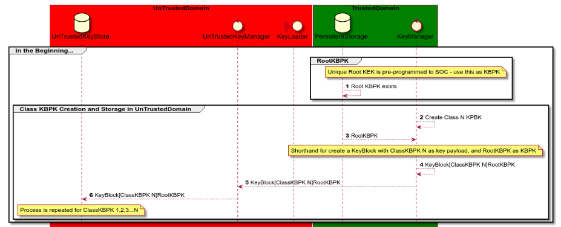

PlantUML can be used to create several UML diagram types from a simple text file description. It can run from command line, editor (e.g. [VSCode plugin](https://marketplace.visualstudio.com/items?itemName=jebbs.plantuml)), browser (e.g. [Chrome browser](https://chrome.google.com/webstore/detail/plantuml-viewer/legbfeljfbjgfifnkmpoajgpgejojooj?hl=en-US)) or [online service via browser](https://www.websequencediagrams.com/).


- For standard UML diagrams (class diagrams, sequence diagrams) auto-generation is a good option. 
- For C4 architecture (Context, Container, Component, Class), it is ideal and [C4 templates exist](https://www.mytechiebits.com/C4).
- For complex non-UML diagrams, where the arrangement of parts is important to convey information, it may be better to just draw a simple Box-and-Line diagram.


# Goals
1. Bring architecture closer to the code so that it is in sync with the code:
   1. code is developed consistent with the architecture
   2. architecture diagrams and description is current and correct
2. Remove the initial friction to create diagrams - by auto-generating them
3. Diagram source text files are version-controlled in GIT in relevant source code repo
4. Consistent diagrams - that can be easily interlinked


# PlantUML Examples
https://real-world-plantuml.com/ gives many examples of PlantUML diagrams.

 
*example of a sequence diagram I created*

# VSCode PlantUML Extension
[VSCode Plantuml Extension](https://marketplace.visualstudio.com/items?itemName=jebbs.plantuml) makes it easy to create and edit plantuml diagrams. It includes a real-time preview. 


# Plantuml for C4 Architecture
 [C4 templates exist](https://www.mytechiebits.com/C4) to create PlantUML diagrams according to the C4 template.


## Use Local Copy of C4 Templates

For each of the template files C4_Context.puml, C4_Context.puml, C4_Component.puml
comment out the includeurl, and uncomment the include, directive. 
```
' !includeurl https://raw.githubusercontent.com/RicardoNiepel/C4-PlantUML/master/C4_Container.puml
' uncomment the following line and comment the first to use locally
!include C4_Container.puml
```


## Add C4 Snippets to VSCode Editor
VSCode supports snippets that predict words as you type. 
VSCcode Snippets for C4 can be installed per 
See https://github.com/RicardoNiepel/C4-PlantUML#snippets-for-visual-studio-code 


# Plantuml for AWS
[Plantuml for AWS](https://github.com/milo-minderbinder/AWS-PlantUML) uses the [icon set from AWS](https://aws.amazon.com/architecture/icons/) and converts these to sprites for use with PlantUML.

```
git clone git@github.com:milo-minderbinder/AWS-PlantUML.git

```

## Simple Example


## More Complex Example


# PlantUML Sprites
PlantUML supports [sprites](http://plantuml.com/sprite) (small graphic elements).
Given we want to make diagrams communicate quickly and clearly, using sprites (rather than just boxes) is very effective.


## PlantUML Sprite Examples
Some good examples of where PlantUML Sprites are used:
* [Plantuml for AWS](https://github.com/milo-minderbinder/AWS-PlantUML)
* https://github.com/rabelenda/cicon-plantuml-sprites/tree/master/sprites that includes Devicons, Material, Weather icons.


## PlantUML Create a Sprite
It's easy to create your own sprites from existing icons.

### Start with a 100x100 person icon png


### Convert to sprite of different resolutions as follows
Download plantuml.jar

```
 java -jar plantuml.jar -encodesprite 4 images/C4person100.png > C4person4.sprite
 java -jar plantuml.jar -encodesprite 16 images/C4person100.png > C4person16.sprite
 java -jar plantuml.jar -encodesprite 8 images/C4person100.png > C4person8.sprite
```


### Create Diagram with our Sprites
See source code 

```
@startuml
sprite $C4person100Small [16x16/16] {
0000004774000000
0000067777600000
0000377777720000
0000477777740000
0000377777730000
0000077777600000
0244467777644420
3777777777777773
6777777777777776
7777777777777777
7777777777777777
7777777777777777
7777777777777777
7777777777777777
5777777777777774
0477777777777640
}

sprite $C4person100Big [100x100/16] {
0000000000000000000000000000000000000000000013456666543100000000000000000000000000000000000000000000
# removed rest of sprite here for clarity

Bob : <$C4person100Small> Small
Alice : <$C4person100Big> Big

Alice -> Bob 
@enduml


```


# References
1. http://plantuml.com/ homepage
2. https://real-world-plantuml.com/umls/4619683198140416 is a PlantUML showcase
3. https://www.planttext.com/ free online site where you can copyNpaste the text description to auto-generate a diagram
4. https://www.websequencediagrams.com/ free online site where you can copyNpaste the text description to auto-generate a diagram
5. https://www.npmjs.com/package/c4builder NPM package using autodoc and C4 template 
6. https://codurance.com/2019/03/17/just-enough-technical-documentation/ Good article that makes reference to a good book "Agile Modelling - Scott Ambler"


