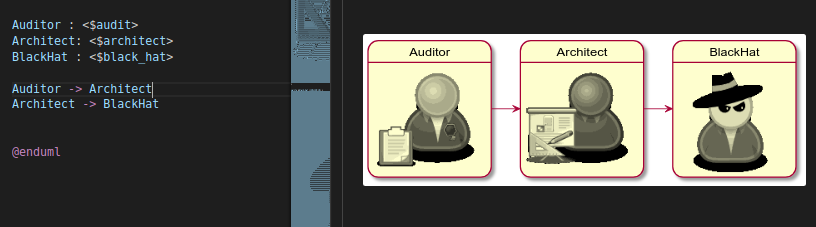

[Open Security Architecture](http://www.opensecurityarchitecture.org/) (OSA) is an excellent resource for security architects providing a catalog of controls, patterns, and requirements from numerous standards, governance frameworks, legislation and regulations. See "[why have OSA?](http://www.opensecurityarchitecture.org/cms/about/why-have-osa)".

Resources include a [security architecture icon library](http://www.opensecurityarchitecture.org/cms/library/icon-library) available under a "[Creative Commons share-alike license](http://www.opensecurityarchitecture.org/cms/about/license-terms)".

Wouldn't it be great if this icon set was available for PlantUML so I, and other architects, could use it with our PlantUML diagrams.... Indeed, so here it is:
https://github.com/Crashedmind/PlantUML-opensecurityarchitecture-icons/tree/master/OSA-Plantuml-Icons 

The next sections walk thru how this was created.
(See https://www.mytechiebits.com/Plantuml for an introduction to PlantUML)

# Converting the icon set to PlantUML Sprites
1. Download the [security architecture icons](http://www.opensecurityarchitecture.org/cms/library/icon-library) and extract them into a directory e.g. "osaicons".
2. Configure and/or add styles to the `puml.ini` configuration file, or create your own
3. Run the `puml.py` script against your downloaded `<ICONS_DIR>` using your custom config

## Pre-Requisites
1. Python 3
   

## Commands
```

# Get OSA icons
mkdir ./OpenSecIcons/
mkdir ./OpenSecIcons/icons/
cd ./OpenSecIcons/icons/
wget http://www.opensecurityarchitecture.org/downloads/13_05_osa_icons_png.zip
unzip ./13_05_osa_icons_png.zip

# Get png to PlantUML conversion script
git clone git@github.com:milo-minderbinder/AWS-PlantUML.git
cd AWS-PlantUML

# Create PlantUML sprites from OSA png icons
python3 puml.py -c ./puml.ini ../OpenSecIcons/icons/ #icons output to ./dist/osa/

```


## Example PlantUML Code and Diagram using these PlantUML icons

*screenshot from VisualStudio Code*


