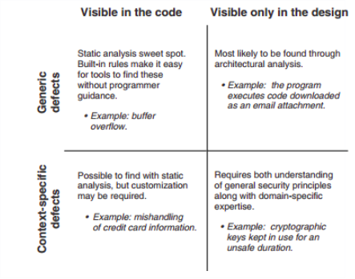
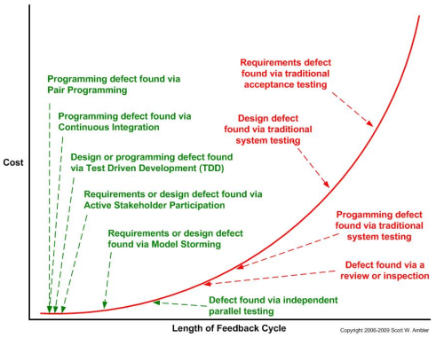

**SW Assurance = Quality + Security**

[Software assurance (SwA)](https://en.wikipedia.org/wiki/Software_assurance) is defined as "the level of confidence that software is free from vulnerabilities, either intentionally designed into the software or accidentally inserted at any time during its lifecycle, and that the software functions in the intended manner."[[1]](https://en.wikipedia.org/wiki/Software_assurance#cite_note-1)

- The main objective of software assurance is to ensure that the processes, procedures, and products used to produce and sustain the software conform to all requirements and standards specified to govern those processes, procedures, and products.[[2]](https://en.wikipedia.org/wiki/Software_assurance#cite_note-DACS-2) 
- A secondary objective of software assurance is to ensure that the software-intensive systems we produce are more secure. For such software-intensive systems, a preventive dynamic and static analysis of the potential vulnerabilities is required, and holistic, system-level understanding is recommended. As stated by Gary McGraw, "Design flaws account for 50% of security problems. One can't find design defects by staring at code. A higher-level understanding is required. That's why architectural risk analysis plays an essential role in any solid software security program."[[3]](https://en.wikipedia.org/wiki/Software_assurance#cite_note-3)

# Software Assurance across the Software Lifecycle
Software Assurance happens across the Software Lifecycle - not in any one process or tool.

The earlier in the Software Lifecycle it happens the better.

Training is the foundation for a Security SDLC - it prevents the defects being put into the code in the first place - detection is much more expensive than prevention, and correction is much more expensive that detection.

# Where are the bugs?
<50% of defects are associated with coding

A significant number of defect occur before any code is written i.e. in Requirement Analysis and Design Phases

1. e.g. [64%](https://www.seguetech.com/rising-costs-defects/) per Crosstalk, the Journal of Defense Software Engineering. 
2. e.g. [45%](https://www.isixsigma.com/industries/software-it/defect-prevention-reducing-costs-and-enhancing-quality/) per Computer Finance Magazine 
 ref: https://www.isixsigma.com/industries/software-it/defect-prevention-reducing-costs-and-enhancing-quality
3. e.g. 50% "Design flaws account for 50% of security problems [Gary McGraw](https://en.wikipedia.org/wiki/Gary_McGraw) (author of many books and over 100 peer-reviewed publications on IT security)

# Where are the Coding Bugs?

# Static Analysis Sweetspot
Of the 4 Defect types in the code, Static Analysis is optimal for only 1: Generic Defects - Visible in the Code i.e. Static Analysis will only find a subset of the defects in the code.

The % of issues findable by static analysis is MUCH closer to 10% than 100%.
- But Static Analysis is very powerful and essential. Understanding its characteristics can lead to applying it optimally in overall context.

An example for illustration purposes: Playing with numbers gives ~12% of defects findable by static analysis ( 1/2 * 1/4 = 1/8)

where

- < 1/2 of defects happen at coding time
- 1/4 of defect types findable by static analysis (visible in the code)

# How are the BIG bugs found?
By "BIG" I mean the ones that hit the headlines and have global impact.

Static Analysis does not find the big media vulnerabilities e.g.
- Heartbleed OpenSSL CVE-2014-0160
- SSL 3.0 Poodle CVE-2014-3566

These are typically found first through fuzzing - not static analysis (and painstaking analysis and reverse engineering by experts and months of work).

A third party tool (e.g. WhiteSourceSoftware, BlackDuck) should be used to be informed of vulnerabilities (these tools also support open source license compliance reporting).

# Static Analysis Applied
Using more than one Static Analysis tool - at different times in the SDLC - gives a better Return On Investment

Different test tools have different characteristics:
1. understanding these characteristics allows the tools to be used optimally
1. using multiple independent/orthogonal tools can be more optimal than using one tool - specifically

The probability that all tools fail to find an issue (i.e. an issue remains in the code) is the product of each tool failing (false negative for that tool)
e.g. if 3 orthogonal tools are applied and have a 50% chance of finding an issue 
then the probality of an issue not being found when the 3 tools are applied is 12.5% 

> (∏i(1-Ci): (1-.5)(1-.5)(1-.5) = .125 = 12.5%
> 
where 
- Detection effectiveness (C) 
- Probability that all Detection fail (F): This is the product of each Detection failing ∏i(1-Ci)

For most tools the individual probality of an issue not being found is significantly higher than 12.5%.

## OWASP SonarQube Project uses multiple independent Static Analysis tools
"The OWASP SonarQube project aims to provide open source SAST using the existing open source solutions. SonarQube is one of the world’s most popular continuous code quality tools and it's actively used by many developers and companies.

This project aims to enable more security functionalities to SonarQube and use it as an SAST. This project will use open source sonar plugins, rules, as well as other open source plugins especially FindSecBugs and its security rules. FindSecBugs enables the taint analysis"

# Signal to Noise

In general, we want to optimize the signal to noise ratio (S/N) i.e. filter - especially in a first pass assessment as this maximes the return on investment/effort. we want to

1. increase the true positives and true negatives
2. decrease the false negatives and false positives

Filtering improves the quality of the result but sacrifices some of the signal to remove most of the noise.

# OWASP Benchmark Project: True and False Positives

https://www.owasp.org/index.php/Benchmark provides [test code in Java](https://github.com/OWASP/benchmark) that allows benchmarking and comparison of different tools.

# Find Coding Issues As Early As possible - As They Are Being Coded

For cost reasons we want to find defects ASAP i.e. not have to wait for a scan on a nightly build or a release etc...

This can be code as code is being typed at development type
e.g. https://www.sonarlint.org/ (Both SonarLint and SonarQube rely on the same static source code analyzers)
e.g. For C/C++ code, I use VSCode on Linux and use Cppcheck plugin to check as I type.

# Books

| Cover         | Title        
|:------------- |:------------
| )](bookstatic.png)   |         

# References

1. http://www.agilemodeling.com/essays/costOfChange.htm
https://arxiv.org/ftp/arxiv/papers/1405/1405.4824.pdf   - paper on ‘Measuring the Cost of Quality (CoQ). Khan et al. 2012 .  -  describes the role of the CoQ financial metric as “all the costs that occur beyond the cost of producing the product ‘right first time’.   Understanding of the CoQ of software products is extremely important in establishing a organizational quality management strategy. 65% of CoQ is in prevention phase (i.e. design into Development phase)
2. https://www.seguetech.com/rising-costs-defects/ - paper  on ‘The Rising Costs of Defects’ by LaTonya Pearson, 2014  - highlights that most errors 64% occur in requirements & design phase of project; and the cost to fix an error  rises from 1x in design phase to 100x in the maintenance phase.  
3. https://www.seguetech.com/bring-software-testers-early/ article on ‘For Great Quality, Bring Your Software Testers in Early’  by LaTonya Pearson, 2013.  - software testing should start as soon as the design and requirements are being baselined. 
4. https://www.etsmtl.ca/Professeurs/claporte/documents/publications/Project-at-bombardier-transportation_SQP_June-2012.pdf  case study paper on ‘measuring the Cost of Software Quality’ Laporte et al. 2012  - 33% of total project spend is on Software Quality.