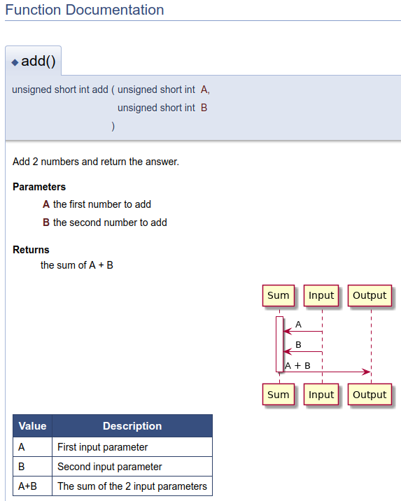

Doxygen can be used to create software documentation using many input (and ouput) formats. Here we use it to combine doxygen tags that describe function parameters, a PlantUML diagram, and Markdown in one input to create an ouput HTML file.

# Goals
1. Bring architecture closer to the code so that it is in sync with the code:
   1. code is developed consistent with the architecture
   2. architecture diagrams and description is current and correct
2. Remove the initial friction to create diagrams - by auto-generating them
3. Diagram source text files are version-controlled in GIT in relevant source code repo
4. Consistent diagrams - that can be easily interlinked
5. Different types of documentation integrated i.e. make it easy to combine documentation into one location a user can view.


# Documentation Types and Tools
Looking at the different software documentation types, and where the source for that documenation should live, and what tool should be used to maintain this documentation, we get a table as follows:


| Documentation Types                                                                                                                  |          Where it lives         |     Tool |
|--------------------------------------------------------------------------------------------------------------------------------------|:-------------------------------:|---------:|
| Source code APIs and usage with e.g. examples                                                      |   In source code files in GIT   |  Doxygen |
| Diagrams e.g. UML sequence diagram for dynamic view, UML Component or Class diagram for static structure | Beside source code files in GIT | PlantUML |
| General verbose desriptions  e.g. User guide, HowTo guides                                                             | Beside source code files in GIT | Markdown |

"Beside" means as close to the source code as makes sense e.g. as part of the repo for a given module, or even as part of the same source code file.

**Doxygen supports all of the above!** 


Note: Swagger is a framework for building RESTful APIs around the OpenAPI Specification. It isn't a code document generator. 


 # Doxygen
 From http://www.doxygen.nl/index.html:


> Doxygen is the de facto standard tool for generating documentation from annotated C++ sources, but it also supports other popular programming languages such as C, Objective-C, C#, PHP, Java, Python, IDL (Corba, Microsoft, and UNO/OpenOffice flavors), Fortran, VHDL, Tcl, and to some extent D.

> Doxygen can help you in three ways:

> 1. It can generate an on-line documentation browser (in HTML) and/or an off-line reference manual (in $\mbox{\LaTeX}$) from a set of documented source files. There is also support for generating output in RTF (MS-Word), PostScript, hyperlinked PDF, compressed HTML, and Unix man pages. The documentation is extracted directly from the sources, which makes it much easier to keep the documentation consistent with the source code.
> 2. You can configure doxygen to extract the code structure from undocumented source files. This is very useful to quickly find your way in large source distributions. Doxygen can also visualize the relations between the various elements by means of include dependency graphs, inheritance diagrams, and collaboration diagrams, which are all generated automatically.
> 3. You can also use doxygen for creating normal documentation (as I did for the doxygen user manual and web-site).


## Markdown
Markdown is very light-weight i.e. minimal overhead to add the markup and formatting.

Github (and other source code repositories) render markdown pages automatically when viewing the page in the repo.

Doxygen version 1.8.0 ownwds supports Markdown per http://www.doxygen.nl/manual/markdown.html. 


## PlantUML

PlantUML makes if very easy to create standard software diagrams. See https://www.mytechiebits.com/Plantuml.

Doxygen supports PlantUML per http://www.doxygen.nl/manual/commands.html#cmdstartuml 

### Doxygen PlantUML Config
The Doxygen configfilename includes a section to configure PlantUML settings:
```
# When using plantuml, the PLANTUML_JAR_PATH tag should be used to specify the
# path where java can find the plantuml.jar file. If left blank, it is assumed
# PlantUML is not used or called during a preprocessing step. Doxygen will
# generate a warning when it encounters a \startuml command in this case and
# will not generate output for the diagram.

PLANTUML_JAR_PATH      = /usr/local/bin/plantuml.jar

# When using plantuml, the PLANTUML_CFG_FILE tag can be used to specify a
# configuration file for plantuml.

PLANTUML_CFG_FILE      =

# When using plantuml, the specified paths are searched for files specified by
# the !include statement in a plantuml block.

PLANTUML_INCLUDE_PATH  =
```


# Doxygen Markdown PlantUML Example 



The above HTML document is generated from this simple source file that contains:
1. Source code
2. Doxygen tags
3. PlantUML Diagram
4. Markdown markup

We run doxygen in the source code directory:
```
$ doxygen ./configfilename 
```

### Source Code Example
Source Code directory contains our source file:

```
/** 
 * 
 * Add 2 numbers and return the answer.
 * 
 * @param A 
 *      the first number to add 
 *
 * @param B
 *      the second number to add 
 * 
 * @return
 *      the sum of A + B

@startuml

activate Sum
Input -> Sum: A
Input -> Sum: B
Sum -> Output: A + B

deactivate Sum
@enduml 


Value  | Description
------------- | -------------
A   | First input parameter 
B   | Second input parameter
A+B | The sum of the 2 input parameters

 */
unsigned short int add (unsigned short int A, unsigned short int B)
{
    return A+B;
}

```
Each section of the above source file is shown separately below:


### Source code

```
unsigned short int add (unsigned short int A, unsigned short int B)
{
    return A+B;
}
```

### Doxygen Tags
```
/** 
 * 
 * Add 2 numbers and return the answer.
 * 
 * @param A 
 *      the first number to add 
 *
 * @param B
 *      the second number to add 
 * 
 * @return
 *      the sum of A + B
 */

```

### Markdown
```
Value  | Description
------------- | -------------
A   | First input parameter 
B   | Second input parameter
A+B | The sum of the 2 input parameters
```


### PlantUML
```
@startuml

activate Sum
Input -> Sum: A
Input -> Sum: B
Sum -> Output: A + B

deactivate Sum
@enduml 

```


