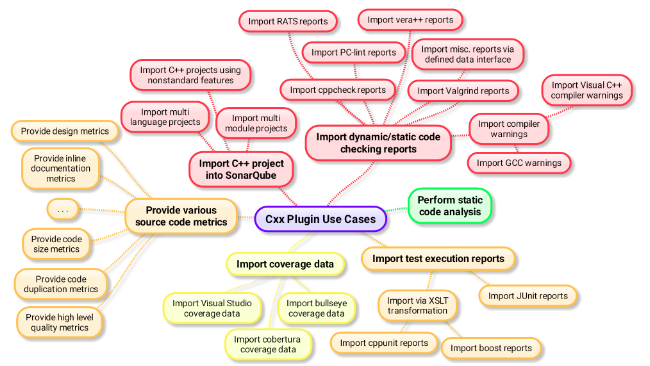
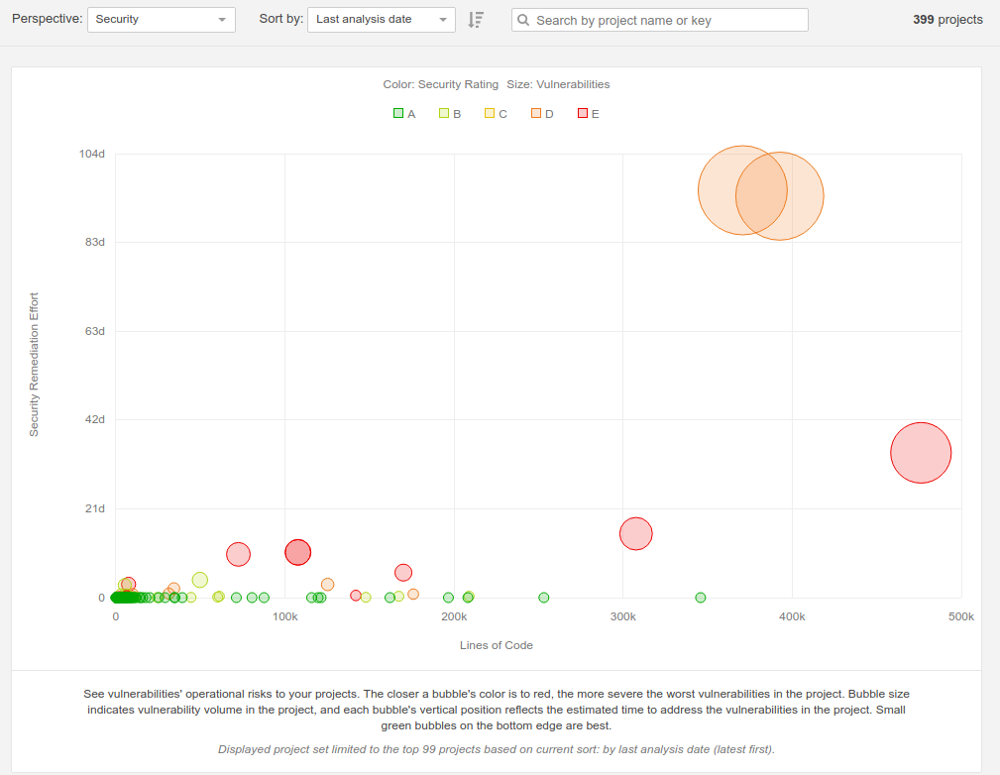

Sonar is an open source platform to manage source code quality:
- Main objective: make code quality management accessible to everyone with minimal effort with a dashboard view and quality gates.
- It basically productizes source code quality management - using the best industry-established metrics and tools.
- Why should we care about source code quality? Because this is the source of the symptoms: failed tests, support cases, escalations and firedrills.

> "You Can't Manage What You Don't Measure" and you need to see and manage your measurements - and this is what Sonar does.

# Sonar
Sonar collects and analyzes source code, measuring quality and providing reports for your projects. It combines static and dynamic analysis tools and enables quality to be measured continuously over time.  Everything that affects our code base, from minor styling details to critical design errors, is inspected and evaluated by SonarQube, thereby enabling developers to access and track code analysis data ranging from styling errors, potential bugs, and code defects to design inefficiencies, code duplication, lack of test coverage, and excess complexity.

Sonar is a continuous inspection dashboard tool that **measures source code quality across 7 axes**

1. Coding standards—respect coding standards and follow best practices
2. Potential bugs—eliminate code violations to prevent vulnerabilities
3. Documentation and comments—provide documentation especially for the Public API, the source code
4. Duplicated code—isolates and refines duplications,
5. Don't Repeat Yourself Complexity—equalizes disproportionate distributed complexity among components; eliminates complexity if possible
6. Test coverage—writes unit tests, especially for complex parts of the software 
7. Design and architecture—minimize dependencies

Its biggest value is the dashboard view of source code quality - pulling data from existing tools like CPPcheck, coverity, unit test reports: code coverage and number of passed/failed/run tests, CVE vulnerability reports.

Sonar makes source code quality management accessible to everyone with minimal effort - both developer, project managers, and management.
It not only provides metrics and statistics about your code but translates these nondescript values to real business values such as risk and technical debt.

It supports many programming languages natively - and via plugins.

WIBNI (wouldn't it be nice if) we had a dashboard that showed source code quality in one place:
1.    unit test status (pass/fail) and coverage (% of code exercised by unit tests)
2.    static analysis reports - coverity and cppcheck 
3.    style guide conformance 
4.    complexity
5.    doxygen in public APIs 
6.    Review publically available sources of vulnerability information report - separate tool/script 
 
This [comment from a review](https://www.itcentralstation.com/product_reviews/sonarqube-review-46011-by-technicae22f) captures this well:
 "SonarQube is not valuable because of the information it gives it. We can gather that same information from several other tools as well. It is the way the information is presented that makes it so powerful. It provides a holistic picture of all quality issues in a software project. With SonarQube's web interface, it is easy to drill down to see the individual problems, but also to look at the project from above and get the big picture, with possible larger problem areas"

# Quality Gates
Sonar allows us to define Quality Gates: the set of conditions the project must meet before it can be released into production e.g. defects, coverage, documented APIs etc...

# Sonar gives early Leading Indicators

Sonar reports can give a reliable predictor of software issues in test or with the customer.

Anyone who's written software can tell you that the more complex or more defects are in the source code, the more likely the software is going to have issues in test or with the customer.

More [formally](https://www.microsoft.com/en-us/research/wp-content/uploads/2016/02/icse05exp.pdf):
1. "Static analysis defect density can be used as early indicators of pre-release defect density";
2. "Static analysis defect density can be used to predict pre-release defect density at statistically significant levels";
3. "Static analysis defect density can be used to discriminate between components of high and low quality"
4. [Nagappan and Ball](http://dl.acm.org/citation.cfm?id=1062455.1062558) found that defects found by static analysis was a predictive metric for defects found by testing.
5. [Nagappan, Ball and Zeller](http://www.irisa.fr/lande/lande/icse-proceedings/icse/p452.pdf) also found a correlation between code complexity metrics and fault-proneness.

# Trends - Measurements over Time
The tools support showing various measurements over time to indicate trends

# Design and Architecture — Minimize Dependencies
One of the 7 code quality axes that Sonar measures is "Design and architecture—minimize dependencies"

Sonar supports many of these metrics out of the box - and the others via plugins (Architect, Explorer).

For background on these metrics, see
https://www.infoq.com/articles/measuring-architecture-sustainability is a good article that shows how architecture sustainability can me measured. 
Software Quality Basics [part 1](http://blog.eisele.net/2009/12/software-quality-basics-i-preface-for.html) and [part 2](http://blog.eisele.net/2009/12/software-quality-basics-ii-ccd-acd-ca.html) gives a good description of metrics related to component coupling  e.g. Average/Cumulative/Normalized Component Dependency (CCD)

# Sonar Reports
Sonor produces various reports starting at a top level overview, and then allowing to click down to source code file level.

Sonar perspectives can be used to prioritize what software issues to address based on risk and constraints.

## Project Overview

## Risk

## Security

## Reliability

## Maintainability

# Books

| Cover         | Title        
|:------------- |:------------
| ](7867os_sonar20code20quality20testing.jpg)   |         Sonar Code Quality Testing Essentials

