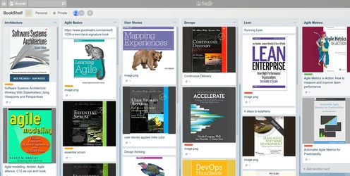
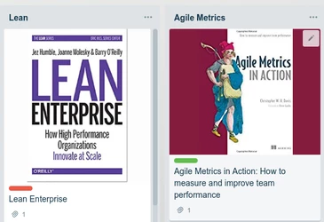
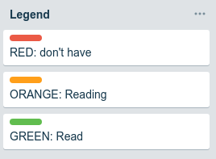
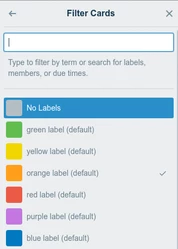
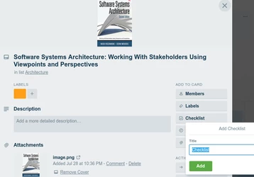
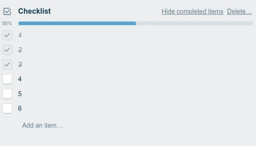
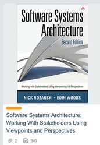

Trello has many uses - including as a virtual bookshelf organised by the value it delivers to you.

Organize books by value to you
1. the area you want to learn about 
2. the value of each book in that area
3. Complement the book with an independent presentation of the material e.g. a powerpoint, a youtube video
   1. Multiple independent forms of learning enrich the learning e.g. read a book then watch the youtube videos by the author

[The Science of Intelligent Achievement: How Smart People Focus, Create and Grow Their Way to Success](https://www.amazon.com/Science-Intelligent-Achievement-People-Success/dp/0857087606)

1. "Investing in yourself is the best investment you will ever make. It will not only improve your life, it will improve the lives of all those around you"
2. "Everything in your life can be taken away from you except for your knowlege, network, ability. Gaining ownership over these three things will accelerate your progress on the path to Intelligent Achieivement"
3. "Successful people are normal people who have learned how to scale themselves really well"

**Use the time you've saved to grow: Trello for Learning: Bookshelf**
See example Trello BookShelf: https://trello.com/b/3Z3wUVlW

Add book or videos here that you want to view.

This is just an organisation of the book covers by topic and priority - the books are in kindle, pdf, hardcopy. It can also include video or other media content.

# Use Labels to indicate book status
Labels allow you to tag items (books) and filter based on that label e.g. if you want to see only the books you are reading.

Add a Legend column to explain what the labels mean

## How to add a label to a card

## How to filter based on label
"Show Menu" - "Filter Cards" - select label

# Use Checklist to show progress by Chapter

Add a number for each chapter to the list.

Check the number when the Chapter is read

The top level card shows the items (Chapters) completed 3 of 6 in this example.

