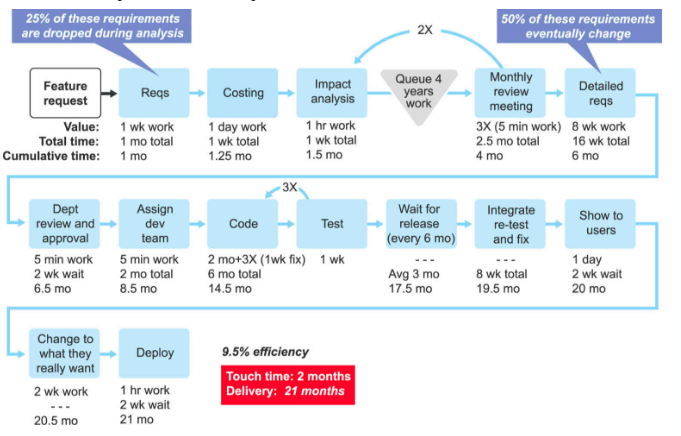
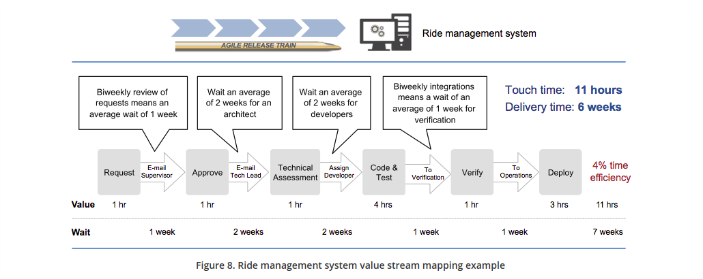

# Reduce Time to Market with Value Stream Mapping

The value stream is the most important organizational construct in [SAFe](http://scaledagileframework.com).

*“Taking a systems view of value delivery" means understanding all the steps from ideation and feature approval to development, through deployment, all the way to release. The total average time for all these steps, including the delay times, is the average time to market for any new feature."*

This gives us one more, important tool in our toolbox. That is the process of value stream mapping, an analytical process teams can use to first understand, and then improve, time to market.

Refs: 
1. http://v4.scaledagileframework.com/value-streams/ 
2. https://www.scaledagileframework.com/sustain-and-improve/

The book "Lean Software Development" recommends using Value Stream Maps to find waste in the Software Development LifeCycle.

## Example value stream map for a hypothetical software company

KPI: Efficiency: Touch Time / Delivery e.g. 2 months/21 months = 9.5% Efficiency

## Example Ride Management System value stream mapping

